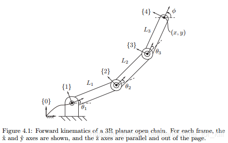
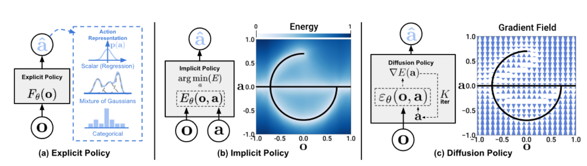
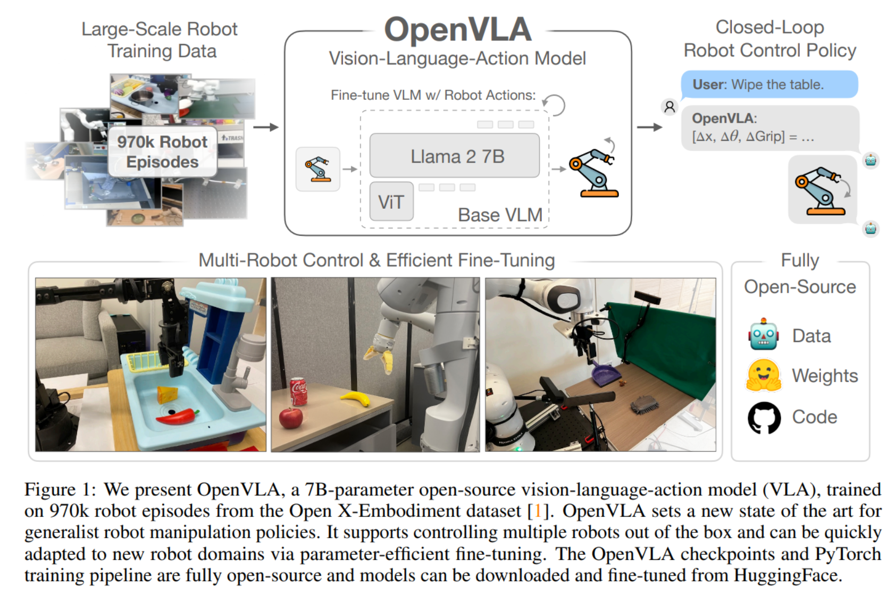
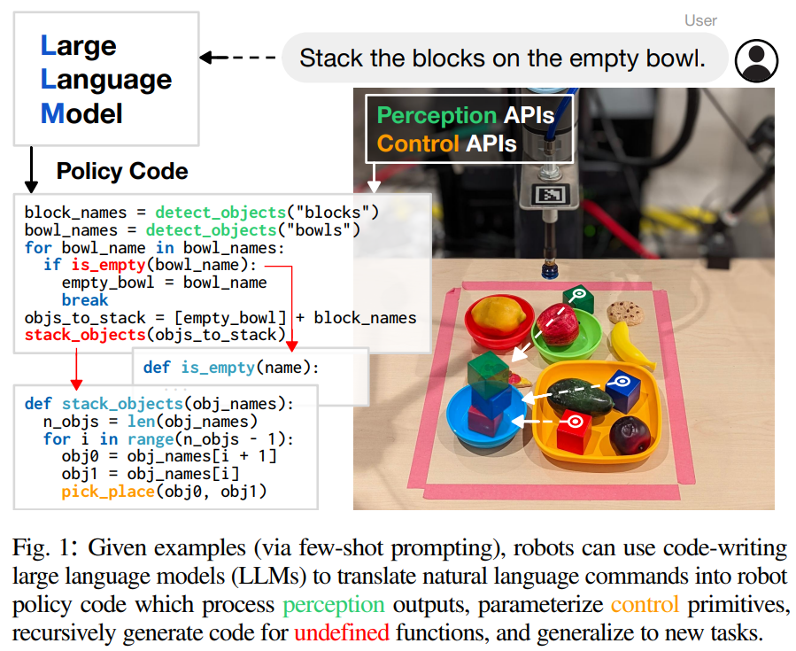
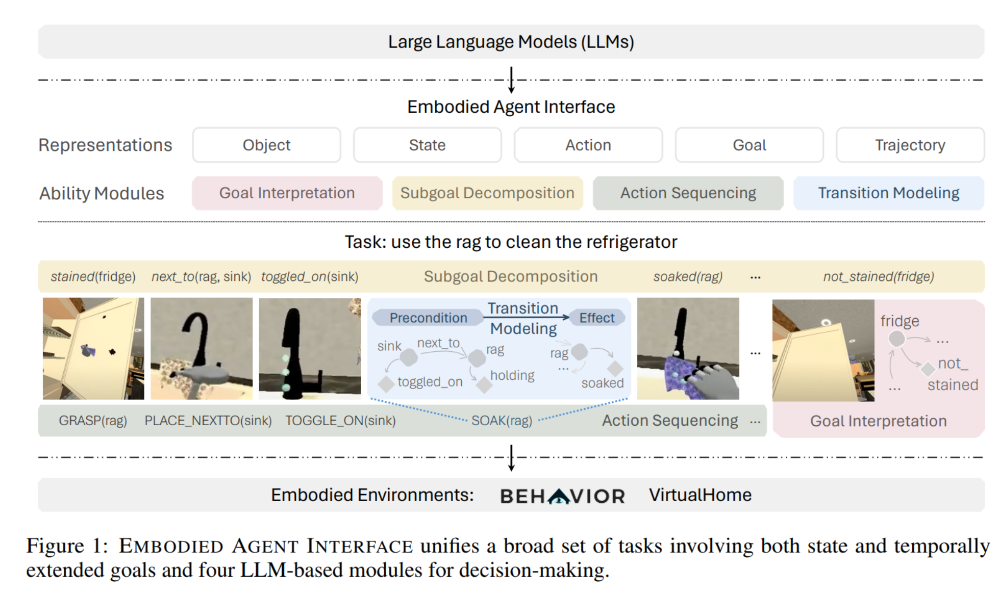
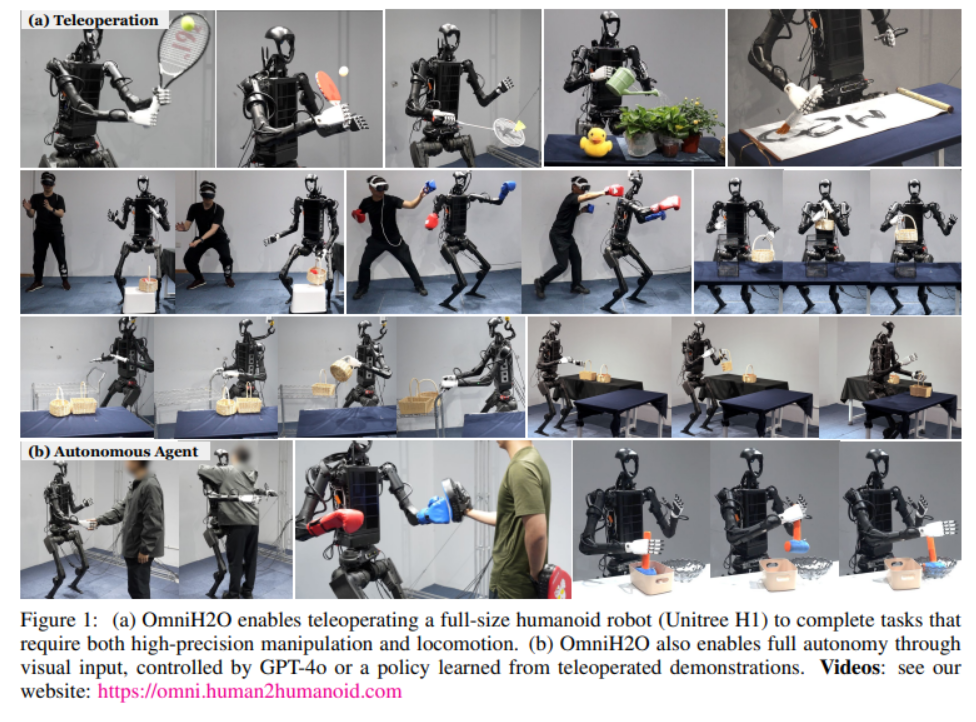

# 具身智能入门学习笔记

[中文版本](./README.md) | [English Version](./README_EN.md)

本仓库是我学习具身智能/人形机器人方向的个人笔记与练习记录，内容涵盖仿真环境搭建、强化学习、模仿学习等方向。

## 入门基础

- 会用 ChatGPT/DeepSeek 和 Google
- 会用 Linux
  - `linux指令.txt`：Linux 常用指令备忘录，包含文件操作、进程管理、GPU 监控、训练日志等
- 会用 Git 和 GitHub
  - <https://learngitbranching.js.org/>

## 任务一：基于传统运动学的机械臂物体抓取

学习传统机器人学中的基础知识，比如基础坐标变换、正逆运动学、动力学、控制理论等，在 PyBullet/Mujoco 仿真中实现基于传统运动控制的机械臂物体抓取。

参考资料：

- Introduction to Robotics: Mechanics and Control — Stanford
- Robotic Manipulation — MIT
- PyBullet：<https://github.com/bulletphysics/bullet3>
- MuJoCo：<https://mujoco.org/>
- 闯关游戏：<https://rcfs.ch/>

### 对应当前仓库内容

- `Robotics_NTU/`
  - 台大《机器人学》课堂笔记整理及配套可视化
- `EI_Mujoco/hello_mujoco.py`
  - MuJoCo 入门练习：创建简单场景、加载物理模型、运行仿真循环

## 任务二：基于强化学习的机械臂物体抓取

1. 学习强化学习基础，在 Gymnasium（OpenAI Gym 的后续维护版本）环境中按推荐顺序训练并测试；
2. 在 PyBullet/Mujoco 中训练机械臂抓取策略，体会 Sim2Real 过程。

参考资料：

- Introduction to Reinforcement Learning, 2nd & David Silver's UCL Course
- UCB CS285 Deep Reinforcement Learning
- Gymnasium：<https://gymnasium.farama.org/index.html>

### 对应当前仓库内容

- `RL_Basics/`
  - 强化学习基础学习路线与笔记入口：先理解 MDP、Bellman、MC/TD、Q-learning、Policy Gradient、Actor-Critic
- `Gymnasium_Basics/`
  - Gymnasium 入门任务路线，按推荐顺序推进：`FrozenLake-v1 -> CartPole-v1 -> Pendulum-v1 -> LunarLander-v3`
- `Gymnasium_Robotics/`
  - 机器人强化学习任务路线：`FetchReach-v3 -> FetchPush-v3 -> FetchPickAndPlace-v3`
- `Robot_Grasping_RL/`
  - 自定义机械臂抓取任务规划：观测设计、动作空间、奖励函数、训练阶段拆分、Sim2Real 检查项
- `EI_Mujoco/hello_mujoco.py`
  - MuJoCo 仿真起点，后续可扩展为自定义机械臂抓取环境

推荐完成顺序：

- `RL_Basics -> Gymnasium_Basics -> Gymnasium_Robotics -> Robot_Grasping_RL`

## 任务三：基于模仿学习的机械臂物体抓取

1. 已完成：复现模仿学习经典 baseline：Diffusion Policy
   - <https://diffusion-policy.cs.columbia.edu>
   - 本仓库记录：[`Diffusion_Policy/`](./Diffusion_Policy/)
2. 学习 HuggingFace 机器人学习框架 LeRobot
   - <https://github.com/huggingface/lerobot>

## 任务四：基于 VLA 大模型的机械臂物体抓取

学习并利用现有 VLA 大模型（OpenVLA / Pi / GR00T 等），探索用开源数据集训练专用 VLA 模型。

参考资料：

- OpenVLA：<https://github.com/openvla/openvla>
- Pi：<https://github.com/Physical-Intelligence/openpi>
- GR00T：<https://github.com/NVIDIA/Isaac-GR00T>
- Open-X Embodiment：<https://robotics-transformer-x.github.io/>
- Large Models：<https://stanford-cs336.github.io/spring2025/>

## 任务五：基于 LLM/VLM 大模型的任务规划

- 桌面级任务规划
  - 参考论文 "Code as Policies" (ICRA 2023)：<https://code-as-policies.github.io/>
  - 用 Prompt 驱动现有 LLM/VLM 完成任务；
  - Finetune 现有 LLM/VLM 完成任务。

- 场景级任务规划
  - 配置仿真环境，跑通 baseline；
  - 设计 ICL 或 CoT 方法提升具身规划效果。

可选仿真环境/Benchmark：

- EAI：<https://github.com/embodied-agent-interface/embodied-agent-interface>
- EmbodiedBench：<https://github.com/EmbodiedBench/EmbodiedBench>

参考论文：

- [Embodied Agent Interface](https://arxiv.org/pdf/2410.07166)
- [VisualAgentBench](https://arxiv.org/pdf/2408.06327)
- [LLM-Planner](https://arxiv.org/abs/2212.04088)
- [ReAct](https://arxiv.org/pdf/2210.03629)

## 任务六：基于强化学习的人形机器人运动控制

复现 [OmniH2O](https://omni.human2humanoid.com/) 的人形机器人运动控制方法，学习仿真训练与 Sim2Real 流程。

参考资料：

- Unitree Robotics GitHub：<https://github.com/unitreerobotics>
- HOVER：<https://github.com/NVlabs/HOVER>
- Underactuated Robotics — MIT

## 前沿研究

- 如何做研究
  - [An Opinionated Guide to ML Research](http://joschu.net/blog/opinionated-guide-ml-research.html)
  - [GAMES003-图形视觉科研基本素养](https://pengsida.net/games003/)
- 会议期刊
  - 机器人：Science Robotics, RSS, CoRL, ICRA, IROS, RLC
  - 机器学习：ICLR, NeurIPS, ICML
  - 计算机视觉：CVPR, ICCV, ECCV
  - 自然语言处理：ACL, EMNLP, COLM
- 在线研讨班
  - [CMU Robotics Institute Seminar](https://www.youtube.com/@cmurobotics)
  - [MIT Robotics Seminar](https://www.youtube.com/@MITRoboticsSeminar)
  - [MIT Embodied Intelligence Seminar](https://www.youtube.com/@mitembodiedintelligence8675)
  - [Stanford Seminar](https://www.youtube.com/@stanfordonline)
