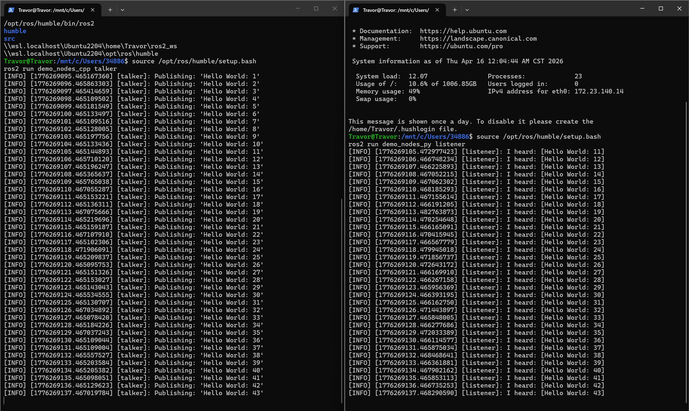
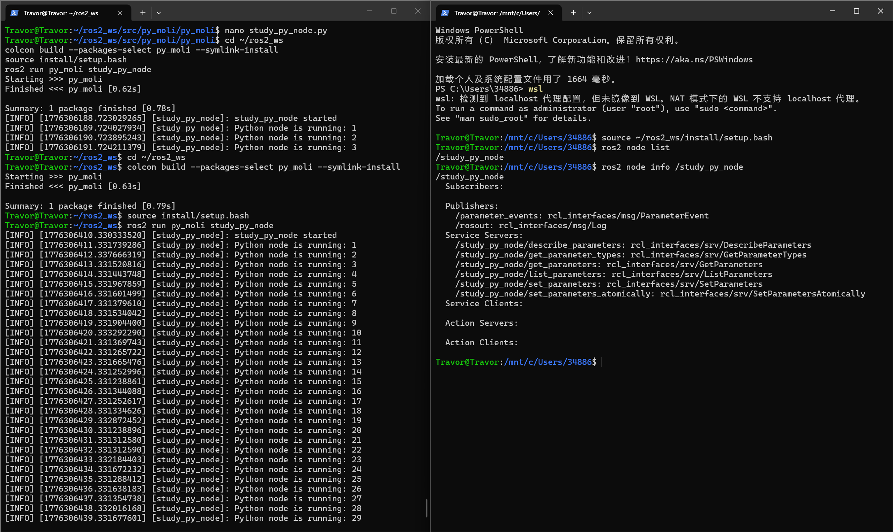
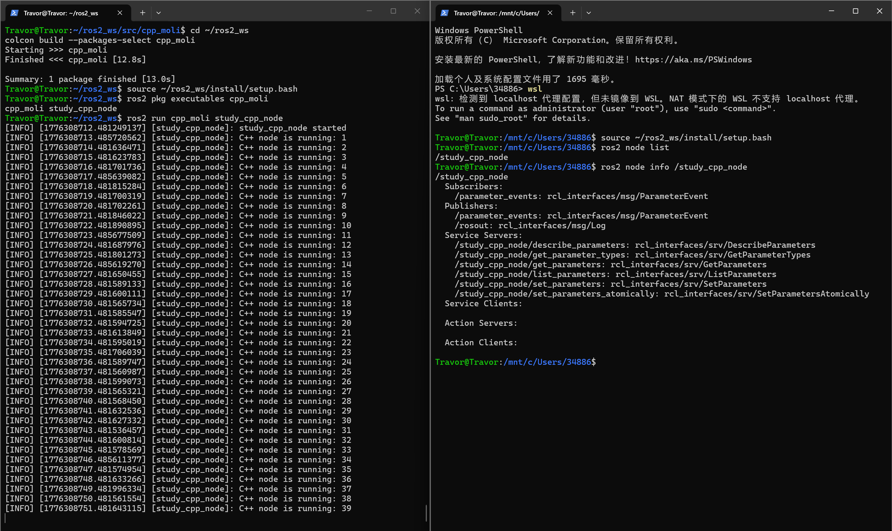
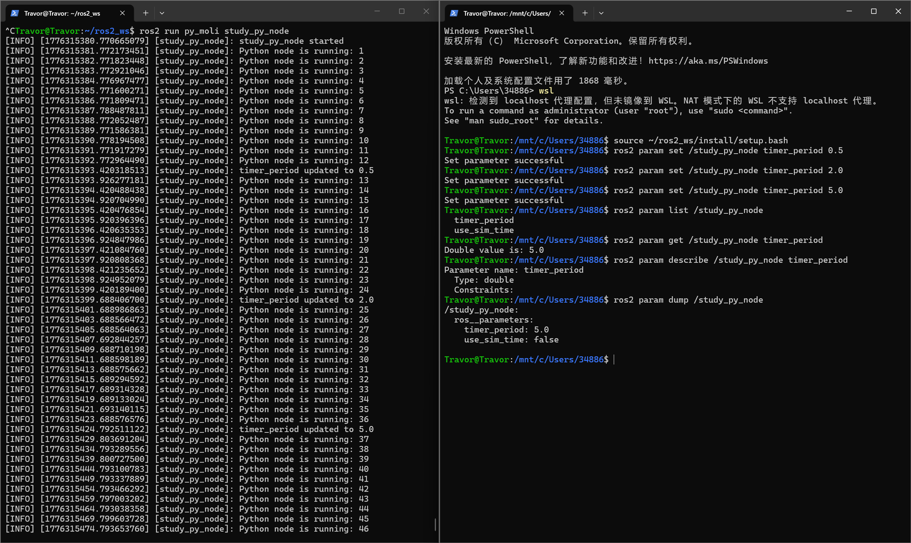
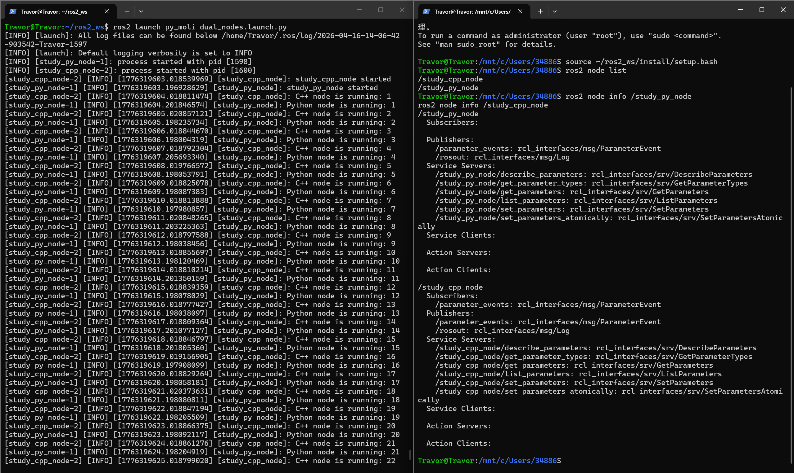
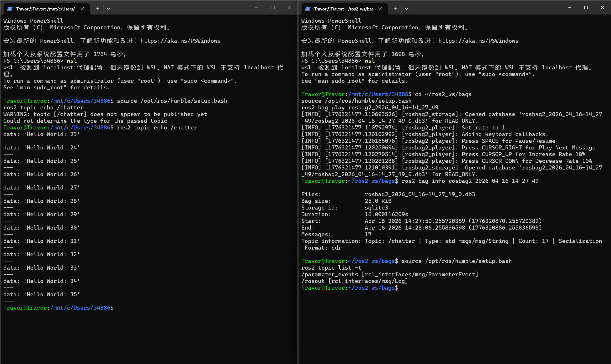
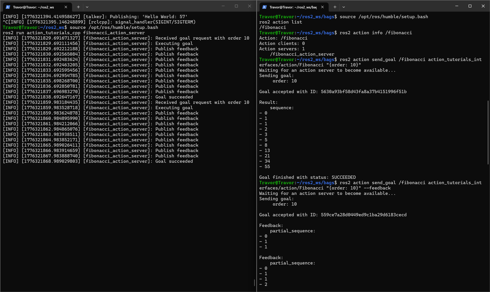
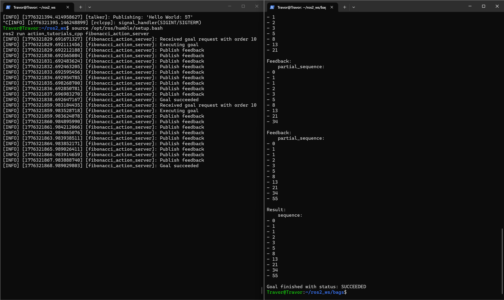

# ROS2 环境检查与第一个节点

> 适用环境：WSL2 + Ubuntu 22.04 + ROS2 Humble

## 导读：这篇文章怎么用

这篇笔记按“先跑起来，再搞明白，再自己动手写”的顺序组织。

- 前半篇先确认环境、运行现成节点、看懂节点、topic、service
- 中段开始自己建立 workspace、理解包和构建工具
- 后半篇再自己写 Python / C++ 节点，并补上构建原理、OOP、进阶阅读和下一步学习路径

如果你是第一次接触 ROS2，建议按顺序看完整篇；如果你已经跑通过 demo，也可以直接从第 8 节往后继续。

## 1. 目标

- 确认 WSL 里已经安装 ROS2，并知道版本、命令位置和常用目录
- 理解 Linux 路径和 Windows 路径在 WSL 场景下如何对应
- 跑通官方示例节点，初步理解 `node`、`topic`、`service`
- 知道 workspace、package、executable、node 这几层分别是什么关系
- 学会用 `colcon` 构建自己的工作空间
- 分别用 `rclpy` 和 `rclcpp` 写出一个最小可运行节点
- 初步接触 `parameter`、`launch`、`bag`、`action` 这些后续高频主题
- 留下命令、输出、截图和结果记录，方便后面复盘

## 2. 主线

1. 安装 ROS2 与配置环境
2. 跑起第一个节点
3. 理解“节点是什么”
4. 理解 topics 和 services
5. 建 workspace，用 `colcon` 构建
6. 用 `rclpy` 写 Python 节点
7. 用 `rclcpp` 写 C++ 节点
8. 再学 parameters、actions、launch、bag

## 3. 环境信息速记

| 项目 | 结果 |
| --- | --- |
| 当前日期 | 2026-04-16 |
| WSL 发行版 | Ubuntu2204（WSL2） |
| Ubuntu 版本 | Ubuntu 22.04 |
| ROS2 发行版 | Humble |
| ROS 版本号 | 2 |
| `ros2` 命令路径 | `/opt/ros/humble/bin/ros2` |
| 工作空间目录 | `~/ros2_ws` |
| Windows 里查看 `ros2_ws` 的路径 | `\\wsl.localhost\Ubuntu2204\home\Travor\ros2_ws` |
| Windows 里查看 ROS 安装目录的路径 | `\\wsl.localhost\Ubuntu2204\opt\ros\humble` |

## 4. 检查 WSL 与 ROS2

### 4.1 执行命令

```bash
wsl -l -v
```

```text
  NAME              STATE           VERSION
* Ubuntu2204        Running         2
  docker-desktop    Stopped         2
```

如果我们已经在 WSL 终端里了，再执行：

```bash
echo $ROS_DISTRO
echo $ROS_VERSION
which ros2
ls /opt/ros
ls ~/ros2_ws
ls ~/ros2_ws/src
wslpath -w ~/ros2_ws
wslpath -w /opt/ros/humble
```

### 4.2 结果

```text
humble
2
/opt/ros/humble/bin/ros2
humble
src
(空目录)
\\wsl.localhost\Ubuntu2204\home\Travor\ros2_ws
\\wsl.localhost\Ubuntu2204\opt\ros\humble
```

## 5. 运行第一个节点

### 5.1 终端 A：启动 talker

```bash
source /opt/ros/humble/setup.bash
ros2 run demo_nodes_cpp talker
```

### 5.2 终端 B：启动 listener

```bash
source /opt/ros/humble/setup.bash
ros2 run demo_nodes_py listener
```

### 5.3 命令解释

- `source /opt/ros/humble/setup.bash` 加载 ROS2 Humble 的环境脚本，让当前终端拿到 `PATH`、`PYTHONPATH`、`LD_LIBRARY_PATH`、`ROS_DISTRO` 等环境变量
- `/opt/ros/humble/setup.bash` 不是普通程序，而是 ROS2 安装目录里的环境配置脚本
- `ros2 run demo_nodes_cpp talker` 不是“用 CMake 运行节点”，而是用 `ros2 run` 查找到包里的可执行文件再启动它
- `demo_nodes_cpp` 是一个用 `ament_cmake` 构建的 C++ 包，`talker` 是它已经编译好的可执行文件
- `demo_nodes_py` 是一个 Python 包，`listener` 是安装后的 Python 可执行入口

### 5.4 运行截图



### 5.5 补充：`source setup.bash` 和 `ros2 run` 到底做了什么

`source /opt/ros/humble/setup.bash` 的作用不是“启动 ROS2”，而是把当前终端切换到 ROS2 Humble 的环境里。

它最重要的效果是把这些信息注入当前 shell：

- `PATH`
- `PYTHONPATH`
- `LD_LIBRARY_PATH`
- `ROS_DISTRO`
- `AMENT_PREFIX_PATH` / `CMAKE_PREFIX_PATH`

这也是为什么很多 ROS2 命令都要求先 `source`。如果没做这一步，系统通常就不知道：

- `ros2` 命令在哪
- `rclpy` Python 包在哪
- `rclcpp` 对应的动态库和 CMake 配置在哪

`ros2 run demo_nodes_cpp talker` 的作用也不是“用 CMake 运行节点”，而是：

1. 先找到 `demo_nodes_cpp` 这个包
2. 再找到包里名为 `talker` 的可执行入口
3. 最后把它启动起来

可以把这里的几个概念先分开记：

- `demo_nodes_cpp`：一个用 `ament_cmake` 构建出来的 C++ 包
- `demo_nodes_py`：一个 Python 包
- `talker` / `listener`：包里可被启动的可执行入口
- `/talker` / `/listener`：真正运行起来后出现在 ROS2 图里的节点名

## 6. 理解“节点是什么”

### 6.1 节点是什么

- ROS2 节点是一个独立完成某项功能的计算单元，可以把它看成一个专职的小进程或功能模块
- 节点不是 VPN 那种“网络中继节点”，它更像机器人系统里的一个小服务
- 一个节点通常只负责一类事情，例如采集传感器、发布控制命令、做定位、做导航

### 6.2 放到这个例子里理解

- `/talker` 是一个节点，负责持续发布字符串消息
- `/listener` 是一个节点，负责订阅并打印收到的字符串消息
- `/chatter` 不是节点，而是它们之间通信使用的 topic
- 这说明 ROS2 里常见模式是：节点做功能，topic 负责传数据

### 6.3 节点、包、可执行文件三者关系

这三个词很容易混在一起，但它们不是一个层级的东西。

- 节点：运行中的计算单元，比如 `/talker`（入口运行起来以后，在 ROS2 计算图里出现的“活的对象”）
- 包：代码、配置和元信息的组织单位，比如 `demo_nodes_cpp`（放代码和配置）
- 可执行文件或入口：节点启动时真正被调用的程序入口，比如 `talker`（包导出的启动入口）

## 7. 理解 topics 和 services

保持 `talker` 和 `listener` 继续运行，再开第三个终端执行：

```bash
source /opt/ros/humble/setup.bash
ros2 node list
ros2 topic list
ros2 topic echo /chatter
ros2 topic info /chatter
ros2 service list
```

### 7.1 输出记录

#### `ros2 node list`

```text
/listener
/talker
```

#### `ros2 topic list`

```text
/chatter
/parameter_events
/rosout
```

#### `ros2 topic echo /chatter`

```text
data: 'Hello World: 10'
---
data: 'Hello World: 11'
---
data: 'Hello World: 12'
---
```

#### `ros2 topic info /chatter`

```text
Type: std_msgs/msg/String
Publisher count: 1
Subscription count: 1
```

#### `ros2 service list`

```text
/listener/describe_parameters
/listener/get_parameter_types
/listener/get_parameters
/listener/list_parameters
/listener/set_parameters
/listener/set_parameters_atomically
/talker/describe_parameters
/talker/get_parameter_types
/talker/get_parameters
/talker/list_parameters
/talker/set_parameters
/talker/set_parameters_atomically
```

### 7.2 要点

- `topic` 适合连续不断的数据流，例如激光雷达、相机、里程计、状态信息
- `service` 适合一次请求、一次响应的交互，例如“查询状态”“触发重置”“计算结果”
- `talker` / `listener` 这个例子里，核心是通过 `/chatter` 这个 topic 在通信
- 我们现在已经实际看到：一个节点持续发布，另一个节点持续接收
- `/parameter_events` 是参数变化时发布事件的 topic
- `/rosout` 是节点日志输出使用的 topic

### 7.3 参数相关 service 说明

`/listener/...` 和 `/talker/...` 这两组 service 含义完全一样，只是作用对象分别是 `listener` 节点和 `talker` 节点。

| Service | 作用 |
| --- | --- |
| `describe_parameters` | 查看参数的说明信息，例如描述、类型、是否只读、取值范围 |
| `get_parameter_types` | 查询参数类型 |
| `get_parameters` | 获取参数当前值 |
| `list_parameters` | 列出该节点有哪些参数 |
| `set_parameters` | 批量设置参数，允许部分成功、部分失败 |
| `set_parameters_atomically` | 原子设置参数，要么全部成功，要么全部失败 |

补充：

- 这些 service 不是我们手写出来的业务 service，而是 ROS2 默认给节点提供的参数管理接口
- `ros2 param list`、`ros2 param get`、`ros2 param set` 这类命令，背后很多时候就是在调用这些参数 service
- 我们现在看到这么多 service，并不代表系统很复杂，而是说明 ROS2 节点默认就支持“远程参数管理”

### 7.4 常用 CLI 速查

下面这些命令是这一阶段最值得熟悉的：

```bash
ros2 run <package_name> <executable_name> # 怎么启动一个节点
ros2 node list # 当前有哪些节点在运行
ros2 node info <node_name> # 某个节点发布/订阅/提供了什么
ros2 topic list # 当前有哪些话题
ros2 topic info <topic_name> # 某个话题的类型、发布者数量、订阅者数量
ros2 service list # 当前有哪些服务
ros2 param list # 当前节点可管理哪些参数
```

## 8. 建 workspace，用 `colcon` 构建

### 8.1 目标

- 知道 ROS2 工作空间的标准结构
- 学会进入工作空间并使用 `colcon` 构建
- 学会 `source install/setup.bash`

### 8.2 指令

如果工作空间还没准备好：

```bash
mkdir -p ~/ros2_ws/src
cd ~/ros2_ws
colcon build
source install/setup.bash
```

如果 `~/ros2_ws` 已经存在，就直接：

```bash
cd ~/ros2_ws
colcon build
source install/setup.bash
```

### 8.3 构建后的目录

```text
ls ~/ros2_ws
build  install  log  src
```

### 8.4 结果

```text

Summary: 0 packages finished [0.68s]
```

说明：表示当前 `~/ros2_ws/src` 里还没有我们自己创建的 package，所以 `colcon` 没有东西可编译，非报错。

### 8.5 工作空间、功能包、节点的关系

到这里，三个最容易混淆的概念基本都出现了：

- 工作空间：包含若干功能包的目录，典型结构是 `src / build / install / log`
- 功能包：ROS2 的代码组织单位，里面放源码、配置和依赖信息
- 节点：功能包里代码运行起来后的执行单元

所以通常关系是：

- 一个工作空间里有多个功能包
- 一个功能包里可以有多个节点
- 一个节点运行后，才会出现在 `ros2 node list` 里

### 8.6 `ros2 pkg` 常用命令

工作空间和功能包的概念一旦建立起来，下面这些命令就会非常顺手：

```bash
ros2 pkg list # 列出当前环境里能找到的所有包
ros2 pkg executables # 列出包导出的可执行入口
ros2 pkg executables turtlesim
ros2 pkg prefix turtlesim # 看某个包安装在哪个前缀目录
ros2 pkg xml turtlesim # 看包的 `package.xml`
```

如果我们想把“包”和“节点入口”联系起来，可以先从这条命令开始：

```bash
ros2 pkg executables demo_nodes_cpp
```

这里很容易产生一个误会：`ros2 pkg executables` 列出来的并不是“当前工作空间等会儿要被 `colcon build` 的所有包”，而是“当前已经 `source` 到环境里的所有包导出的可执行入口”。

我们现在之所以会看到一大长串，是因为：

- 我们先执行了 `source /opt/ros/humble/setup.bash`
- 这会把 `/opt/ros/humble` 下已经安装好的 ROS2 Desktop 包全部放进当前环境
- 所以 `demo_nodes_cpp`、`turtlesim`、`rviz2`、`rqt_*` 这些系统里现成的包都会被列出来

但 `colcon build` 的工作范围不是“把环境里所有包重新编一遍”，而是：

- 默认只构建当前工作空间 `src/` 目录里发现的包
- 如果 `src/` 还是空的，就会出现 `0 packages finished`
- 如果我们用 `colcon build --packages-select YOUR_PKG_NAME`，就只构建我们点名的那个包
- 如果我们用 `colcon build --packages-up-to YOUR_PKG_NAME`，就构建该包以及它在当前工作空间里需要一起构建的上游依赖

我们可以用下面几条命令把“环境里能运行的包”和“当前工作空间里要构建的包”区分开：

```bash
ros2 pkg prefix demo_nodes_cpp # 如果显示 `/opt/ros/humble`，说明它是系统已经安装好的包
colcon list # 列的是当前工作空间源码里会参与构建的包
find src -name package.xml # 可以直接看 `src/` 里到底有几个功能包
```

### 8.7 `colcon` 常用参数

我们已经知道 `colcon build` 可以构建整个工作空间了，接下来最常用的是这几个参数：

```bash
colcon build --packages-select YOUR_PKG_NAME # 只编一个包，速度更快
colcon build --packages-up-to YOUR_PKG_NAME
colcon build --symlink-install # 对 Python 包特别友好，改代码后通常不必重新复制安装文件
colcon build --cmake-args -DBUILD_TESTING=0 # 不构建测试，能稍微省一点时间
colcon test # 后面开始写多个包时能帮助我们检查构建结果
```

### 8.8 构建与依赖查找为什么要懂

在 ROS2 里，平时确实很少手写长串的 `g++` 或 `make` 命令，但理解这些底层概念会直接决定我们能不能快速看懂报错。

最值得先认识的几个概念是：

- `-I`
  - 告诉编译器去哪里找头文件
- `-L`
  - 告诉链接器去哪里找库文件
- `-lxxx`
  - 指定要链接哪个库

最常见的两类 C++ 报错：

- `No such file or directory`
  - 通常表示头文件路径没找到
- `undefined reference to ...`
  - 通常表示链接阶段没找到符号实现

日常写 ROS2 C++ 包时，我们通常不会手敲这些参数，而是让 `CMakeLists.txt` 和 `find_package(...)` 替我们处理。之所以它能处理，是因为环境变量告诉了工具“去哪里找依赖”。

最相关的变量是：

- `CMAKE_PREFIX_PATH`
- `PATH`

可以直接在终端里看看：

```bash
echo $PATH
echo $CMAKE_PREFIX_PATH
find /opt/ros/humble -path "*rclcpp*Config.cmake" 2>/dev/null
```

Python 这边对应的重点是：

- `PYTHONPATH`

我们也可以马上验证：

```bash
echo $PYTHONPATH
python3 -c "import rclpy; print(rclpy.__file__)"
```

如果将来遇到：

- `ModuleNotFoundError: No module named 'rclpy'`

那通常就意味着当前终端没有正确加载 ROS2 的 Python 搜索路径。

另外，Python 包之所以能被 `ros2 run` 找到，不只是因为我们写了一个 `.py` 文件，还因为：

- `setup.py` 描述了这个 Python 包怎么安装
- `entry_points.console_scripts` 把入口函数注册成了可执行命令

这也是为什么后面写 `rclpy` 节点时，我们必须同时修改代码和 `setup.py`。

## 9. 用 `rclpy` 写 Python 节点

### 9.1 目标

- 创建一个 Python 包
- 在包里写自己的 ROS2 Python 节点
- 能用 `ros2 run` 跑起来

### 9.2 创建包

```bash
cd ~/ros2_ws/src
ros2 pkg create py_pubsub --build-type ament_python --dependencies rclpy std_msgs
```

### 9.3 目录结构

```text
py_pubsub/
├── package.xml
├── resource/
│   └── py_pubsub
├── py_pubsub/
│   └── __init__.py
├── setup.cfg
├── setup.py
└── test/
```

可以先这样理解：

- `package.xml` 记录包的元信息和依赖
- `setup.py` / `setup.cfg` 负责 Python 包安装与入口声明
- `py_pubsub/` 目录里放我们自己的 Python 代码
- `resource/` 让 ROS2 识别这个包

### 9.4 我们自己的最小 Python 节点

在 `~/ros2_ws/src/py_pubsub/py_pubsub` 下新建 `study_py_node.py`：

```python
import rclpy
from rclpy.node import Node


class StudyPyNode(Node):
    def __init__(self):
        super().__init__("study_py_node")
        self.get_logger().info("study_py_node 已启动")


def main(args=None):
    rclpy.init(args=args)
    node = StudyPyNode()
    rclpy.spin(node)
    node.destroy_node()
    rclpy.shutdown()
```

这个最小节点主要体现了这些步骤：

- `rclpy.init()`：初始化客户端库
- `Node(...)`：创建节点
- `get_logger().info(...)`：打印日志
- `rclpy.spin(node)`：让节点保持运行
- `rclpy.shutdown()`：退出前关闭 rclpy

### 9.5 修改 `setup.py`

`setup.py` 里最关键的是 `entry_points`，因为 ROS2 需要靠它把 Python 文件注册成可以被 `ros2 run` 找到的入口。

把下面这一段写进 `setup.py` 的 `entry_points`：

```python
entry_points={
    "console_scripts": [
        "study_py_node = py_pubsub.study_py_node:main",
    ],
},
```

### 9.6 构建与运行

```bash
cd ~/ros2_ws
colcon build --packages-select py_pubsub --symlink-install
source install/setup.bash
ros2 run py_pubsub study_py_node
```

为什么这里推荐 `--symlink-install`：

- 改 Python 代码时，通常不用每次都全量重新拷贝安装文件
- 对学习阶段特别友好

### 9.7 验证

运行后再开一个终端：

```bash
source ~/ros2_ws/install/setup.bash
ros2 node list
ros2 node info /study_py_node
```

正常的话应该能看到：

- `/study_py_node` 出现在节点列表里
- `ros2 node info` 能看到这个节点的基本信息

### 9.8 常见问题

- `ModuleNotFoundError: No module named 'rclpy'`
  - 通常是当前终端没 `source /opt/ros/humble/setup.bash`
- `Package 'py_pubsub' not found`
  - 通常是工作空间没 `colcon build`，或者 build 后没 `source install/setup.bash`
- `No executable found`
  - 通常是 `setup.py` 里的 `entry_points` 没配对

### 9.9 结果



## 10. 用 `rclcpp` 写 C++ 节点

### 10.1 目标

- 创建一个 C++ 包
- 在包里写自己的 ROS2 C++ 节点
- 配置 `CMakeLists.txt` 与 `package.xml`

### 10.2 创建包

```bash
cd ~/ros2_ws/src
ros2 pkg create cpp_pubsub --build-type ament_cmake --dependencies rclcpp std_msgs
```

### 10.3 目录结构

```text
cpp_pubsub/
├── CMakeLists.txt
├── package.xml
├── include/
│   └── cpp_pubsub/
└── src/
```

### 10.4 我们自己的最小 C++ 节点

在 `~/ros2_ws/src/cpp_pubsub/src` 下新建 `study_cpp_node.cpp`：

```cpp
#include "rclcpp/rclcpp.hpp"

class StudyCppNode : public rclcpp::Node
{
public:
  StudyCppNode() : Node("study_cpp_node")
  {
    RCLCPP_INFO(this->get_logger(), "study_cpp_node 已启动");
  }
};

int main(int argc, char ** argv)
{
  rclcpp::init(argc, argv);
  auto node = std::make_shared<StudyCppNode>();
  rclcpp::spin(node);
  rclcpp::shutdown();
  return 0;
}
```

这个最小节点主要体现了这些步骤：

- `class ... : public rclcpp::Node`：节点本身就是一个类
- 构造函数里可以完成初始化、定时器、订阅器、发布器等设置
- `RCLCPP_INFO`：使用 ROS2 的日志系统
- `spin`：保持节点运行

### 10.5 修改 `CMakeLists.txt`

在 `CMakeLists.txt` 里补上：

```cmake
add_executable(study_cpp_node src/study_cpp_node.cpp)
ament_target_dependencies(study_cpp_node rclcpp)

install(TARGETS
  study_cpp_node
  DESTINATION lib/${PROJECT_NAME}
)
```

### 10.6 构建与运行

```bash
cd ~/ros2_ws
colcon build --packages-select cpp_pubsub
source install/setup.bash
ros2 run cpp_pubsub study_cpp_node
```

### 10.7 验证

再开一个终端：

```bash
source ~/ros2_ws/install/setup.bash
ros2 node list
ros2 node info /study_cpp_node
```

### 10.8 常见问题

- `fatal error: rclcpp/rclcpp.hpp: No such file or directory`
  - 通常是 ROS2 环境没有 source
- `Package 'cpp_pubsub' not found`
  - 通常是工作空间没 build 或没 source install
- `No executable found`
  - 通常是 `CMakeLists.txt` 里没把目标装到 `lib/${PROJECT_NAME}`

### 10.9 结果记录



## 11. 把最小节点扩成工程

### 11.1 为什么后续推荐类式节点

最小 demo 里，直接在 `main()` 里创建节点当然没问题，但代码一旦变复杂，很快就会遇到这些需求：

- 要在一个地方统一初始化发布器、订阅器、定时器和参数
- 要把不同功能拆成清晰的方法
- 要给节点扩展更多状态和行为

这时把节点写成类通常更合适。我们在上面的 `StudyPyNode` 和 `StudyCppNode` 其实已经在做这件事了。

可以先这样区分：

- 面向过程：适合最小 demo 和临时脚本
- 面向对象：适合后续工程化、模块化和扩展

### 11.2 从最小节点走向工程代码

当节点写成类以后，后续最常见的扩展方向是：

- 在构造函数里创建发布器和订阅器
- 增加参数读取逻辑
- 增加定时器回调
- 把业务逻辑拆成成员函数

这样做的好处是：

- 初始化逻辑集中
- 代码更容易复用
- 后面增加 topic / service / action 时结构更稳定

### 11.3 `ROS_DOMAIN_ID` 与多机通信

ROS2 默认基于 DDS 做发现和通信，多机通信时一个常见配置项是：

- `ROS_DOMAIN_ID`

因为：

- 同一个 `ROS_DOMAIN_ID` 下的节点更容易互相发现
- 不同 `ROS_DOMAIN_ID` 的节点默认彼此隔离

最常用命令：

```bash
echo $ROS_DOMAIN_ID
export ROS_DOMAIN_ID=7
```

如果以后要做局域网里的两机通信，通常要同时检查：

- 两台机器 ROS2 版本是否兼容
- 是否在同一网络
- `ROS_DOMAIN_ID` 是否一致
- 防火墙是否拦住 DDS 相关端口

在我们现在这个单机 WSL 学习阶段，只要先知道这个概念就够了，暂时不用动它。

## 12. 第八步：再学 parameters、actions、launch、bag

### 12.1 这一节的目标

到了这一步，我们已经能：

- 自己创建 Python 包和 C++ 包
- 用 `colcon build` 构建工作空间
- 运行 `study_py_node` 和 `study_cpp_node`

接下来要补的，是 ROS2 里最常一起出现的四个主题：

- `parameters`
- `launch`
- `bag`
- `actions`

这一节先通过 4 个最小练习，把这些概念和命令跑通：

- 用参数调节点行为
- 用 launch 一次启动多个节点
- 用 bag 录制和回放数据
- 用 action 体验长任务接口

### 12.2 parameters

#### 12.2.1 parameters 是什么

`parameter` 可以理解成“节点运行时的配置项”。

和把常量硬编码在代码里相比，参数的好处是：

- 不用改代码就能调整节点行为
- 可以在运行时查看节点当前配置
- 适合把频率、阈值、开关项这些东西从代码里拿出来

常见参数例子有：

- 定时器周期
- 日志级别
- 话题名称
- 是否启用某个功能

#### 12.2.2 为什么节点要用参数

你前面写的 `study_py_node` 是一个定时打印日志的节点。现在如果想把“每秒打印一次”改成“每 0.5 秒打印一次”或“每 2 秒打印一次”，最自然的做法就不是每次改代码，而是把时间间隔做成参数。

也就是说：

- 代码负责节点逻辑
- 参数负责节点配置

#### 12.2.3 给 Python 节点加 `timer_period` 参数

这一小练习默认你已经有：

- Python 包：`py_moli`
- Python 节点：`study_py_node`

最小目标分两层：

1. 先在节点里声明 `timer_period` 参数
2. 再用命令行查看、读取、设置它

如果你的节点代码已经支持根据参数创建定时器，那么改参数后打印频率会跟着变化；如果当前代码还没有做“运行时动态更新定时器”的逻辑，也没关系，先做到“参数能看到、能读取、能设置”就已经达成这一节的最小目标了。

#### 12.2.4 命令行操作

终端 A：启动 Python 节点

```bash
source ~/ros2_ws/install/setup.bash
ros2 run py_moli study_py_node

# 如果想在启动时直接设成别的值
ros2 run py_moli study_py_node --ros-args -p timer_period:=2.0
```

终端 B：查看和设置参数

```bash
source ~/ros2_ws/install/setup.bash
ros2 param list /study_py_node
ros2 param get /study_py_node timer_period
ros2 param set /study_py_node timer_period 0.5
ros2 param set /study_py_node timer_period 2.0
```

如果你想更完整地观察参数，还可以继续执行：

```bash
ros2 param describe /study_py_node timer_period # 看某一个参数的说明书
ros2 param dump /study_py_node # 把一个节点当前所有参数值导出来
```

注意：

- 参数设置命令能否立刻改变节点行为，取决于节点代码有没有处理参数变化
- 命令本身执行成功，不等于节点就一定已经实现“动态生效”

#### 12.2.5 结果



### 12.3 再学 launch

#### 12.3.1 launch 是什么

`launch` 可以理解成“节点启动脚本”。

它解决的问题是：当系统里不止一个节点时，如果每次都手动开多个终端、分别输入多条 `ros2 run` 命令，会很麻烦，也很难复现。

于是 ROS2 提供了 `launch` 机制，让你：

- 一次启动多个节点
- 给不同节点传参数
- 组织启动顺序
- 把一组常用启动命令固化下来

#### 12.3.2 为什么不想一直手开多个终端

你现在已经有两个最小节点：

- `/study_py_node`
- `/study_cpp_node`

如果每次都这样启动：

```bash
ros2 run py_moli study_py_node
ros2 run cpp_moli study_cpp_node
```

短期还可以接受，但节点一多就很容易乱：

- 终端数量变多
- 容易漏掉某个节点
- 别人很难复现你的启动步骤

这就是 `launch` 的价值所在。

#### 12.3.3 一次启动 Python 节点和 C++ 节点

这里默认我们后面会创建一个 launch 文件：

- `~/ros2_ws/src/py_moli/launch/dual_nodes.launch.py`

它的目标很明确：

- 一次拉起 `study_py_node`
- 同时拉起 `study_cpp_node`

这样后面你只需要记一条命令，而不是两条 `ros2 run`。

#### 12.3.4 命令行操作

运行 launch 文件：

```bash
source ~/ros2_ws/install/setup.bash
ros2 launch py_moli dual_nodes.launch.py
```

新终端里验证节点是否都起来了：

```bash
source ~/ros2_ws/install/setup.bash
ros2 node list
ros2 node info /study_py_node
ros2 node info /study_cpp_node
```

如果你想对比 `ros2 run` 和 `ros2 launch` 的区别，可以这样理解：

- `ros2 run`：启动一个包里的一个可执行入口
- `ros2 launch`：按一个启动脚本组织地启动多个节点

#### 12.3.5 结果



### 12.4 再学 bag

#### 12.4.1 bag 是什么

`bag` 可以理解成“ROS2 运行数据的录音机”。

它主要做两件事：

- 把 topic 上流过的数据录下来
- 之后再把录下来的数据回放出来

这在调试、复现 bug、做实验记录时非常有用。

#### 12.4.2 为什么调试和复现离不开 bag

如果某个问题只在某次运行时出现，而你又没有把当时的数据留下来，那么后面就很难分析。

而有了 `bag` 之后，你可以：

- 把当时的 topic 数据录下来
- 之后脱离真实设备重复回放
- 用同一份数据重复测试别的节点

要注意的是：

- `bag` 记录的是 topic 数据
- 不是整个程序的全部状态

#### 12.4.3 最小实操：录制并回放一个 topic

为了保证这一节马上可执行，这里先不要求你自己的节点马上变成 publisher，而是直接用前面已经跑通过的 `/chatter` demo 做最小闭环。

最小目标是：

1. 用 `talker` 发布 `/chatter`
2. 用 `ros2 bag record` 录制 `/chatter`
3. 停止录制后查看 bag 信息
4. 再用 `ros2 bag play` 回放

#### 12.4.4 命令行操作

终端 A：启动 talker

```bash
source /opt/ros/humble/setup.bash
ros2 run demo_nodes_cpp talker
```

终端 B：录制 `/chatter`

```bash
source /opt/ros/humble/setup.bash
ros2 bag record /chatter
```

录一小段后按 `Ctrl + C` 停止，目录里会生成一个 bag 文件夹。然后查看信息：

```bash
ros2 bag info <bag目录名>
```

回放录制结果：

```bash
source /opt/ros/humble/setup.bash
ros2 bag play <bag目录名>
```

可选终端 C：观察回放数据

```bash
source /opt/ros/humble/setup.bash
ros2 topic echo /chatter
```

#### 12.4.5 结果



### 12.5 最后学 actions

#### 12.5.1 action 是什么

`action` 适合表达“执行时间比较长的任务”。

和普通 service 相比，action 的特点是：

- 可以发起一个目标
- 执行过程中可以持续收到反馈
- 最终会有结果
- 某些情况下还可以取消

#### 12.5.2 action 和 service 的区别

最简单的区分方法是：

- `service`：一次请求，一次响应，适合短操作
- `action`：一次目标，持续反馈，最终结果，适合长任务

举例来说：

- “帮我把两个数加起来”更像 service
- “帮我导航到某个位置并不断告诉我进度”更像 action

#### 12.5.3 最小实操：跑一次 Fibonacci action demo

这一节先不要求你马上自己手写 action server/client，而是先用官方 demo 体验一遍 action 的交互模式。

实现：

1. 启动 Fibonacci action server
2. 查看当前 action
3. 发送一个 goal
4. 观察结果
5. 可选观察 feedback

#### 12.5.4 命令行操作

终端 A：启动 action server

```bash
source /opt/ros/humble/setup.bash
ros2 run action_tutorials_cpp fibonacci_action_server
```

终端 B：查看和发送 goal

```bash
source /opt/ros/humble/setup.bash
ros2 action list
ros2 action info /fibonacci
ros2 action send_goal /fibonacci action_tutorials_interfaces/action/Fibonacci "{order: 10}"
```

如果你想看到执行过程中的反馈，再执行：

```bash
ros2 action send_goal /fibonacci action_tutorials_interfaces/action/Fibonacci "{order: 10}" --feedback
```

#### 12.5.5 结果




### 12.6 关系总结

- `topic`：持续数据流
- `service`：一次请求，一次响应
- `action`：长任务接口，用来处理带反馈、可取消的任务
- `parameter`：节点配置项，用来调节点行为
- `launch`：启动组织工具，用来一起启动多个节点
- `bag`：数据记录与回放工具，用来保存和重现 topic 数据

## 13. 参考资料与延伸阅读

### 13.1 鱼香《动手学 ROS2》Humble 第 2 章

- [章节导读](https://github.com/fishros/d2l-ros2/blob/master/docs/humble/chapt2/%E7%AB%A0%E8%8A%82%E5%AF%BC%E8%AF%BB.md)
- [节点介绍](https://github.com/fishros/d2l-ros2/blob/master/docs/humble/chapt2/get_started/1.ROS2%E8%8A%82%E7%82%B9%E4%BB%8B%E7%BB%8D.md)
- [功能包与工作空间](https://github.com/fishros/d2l-ros2/blob/master/docs/humble/chapt2/get_started/2.ROS2%E5%8A%9F%E8%83%BD%E5%8C%85%E4%B8%8E%E5%B7%A5%E4%BD%9C%E7%A9%BA%E9%97%B4.md)
- [Colcon](https://github.com/fishros/d2l-ros2/blob/master/docs/humble/chapt2/get_started/3.ROS2%E6%9E%84%E5%BB%BA%E5%B7%A5%E5%85%B7%E4%B9%8BColcon.md)
- [RCLCPP 编写节点](https://github.com/fishros/d2l-ros2/blob/master/docs/humble/chapt2/get_started/4.%E4%BD%BF%E7%94%A8RCLCPP%E7%BC%96%E5%86%99%E8%8A%82%E7%82%B9.md)
- [RCLPY 编写节点](https://github.com/fishros/d2l-ros2/blob/master/docs/humble/chapt2/get_started/5.%E4%BD%BF%E7%94%A8RCLPY%E7%BC%96%E5%86%99%E8%8A%82%E7%82%B9.md)
- [编程基础与依赖查找](https://github.com/fishros/d2l-ros2/tree/master/docs/humble/chapt2/basic)
- [进阶篇](https://github.com/fishros/d2l-ros2/tree/master/docs/humble/chapt2/advanced)

### 13.2 ROS2 官方文档

- [Humble 文档首页](https://docs.ros.org/en/humble/index.html)
- [Understanding ROS 2 nodes](https://docs.ros.org/en/humble/Tutorials/Beginner-CLI-Tools/Understanding-ROS2-Nodes/Understanding-ROS2-Nodes.html)
- [Creating a workspace](https://docs.ros.org/en/humble/Tutorials/Beginner-Client-Libraries/Creating-A-Workspace/Creating-A-Workspace.html)
- [Colcon tutorial](https://docs.ros.org/en/humble/Tutorials/Colcon-Tutorial.html)
- [Writing a simple C++ publisher and subscriber](https://docs.ros.org/en/humble/Tutorials/Beginner-Client-Libraries/Writing-A-Simple-Cpp-Publisher-And-Subscriber.html)
- [Writing a simple Python publisher and subscriber](https://docs.ros.org/en/humble/Tutorials/Beginner-Client-Libraries/Writing-A-Simple-Py-Publisher-And-Subscriber.html)
- [About Domain ID](https://docs.ros.org/en/humble/Concepts/Intermediate/About-Domain-ID.html)

## 14. 可选补充：路径映射速查

| Linux 路径 | Windows 路径 |
| --- | --- |
| `~/ros2_ws` | `\\\\wsl.localhost\\Ubuntu2204\\home\\Travor\\ros2_ws` |
| `/opt/ros/humble` | `\\\\wsl.localhost\\Ubuntu2204\\opt\\ros\\humble` |
