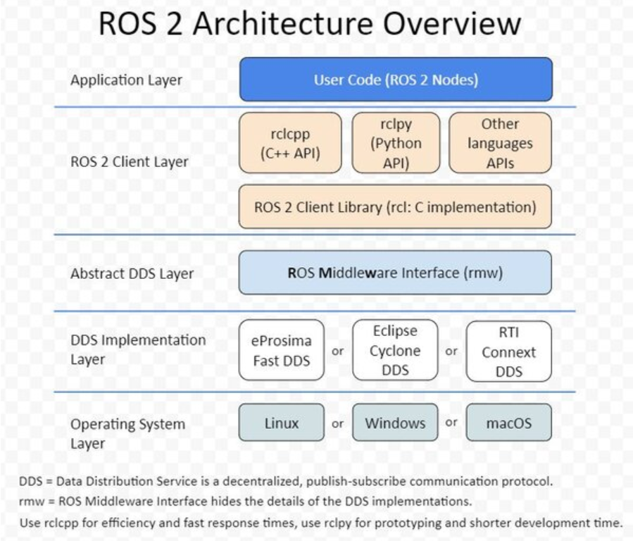
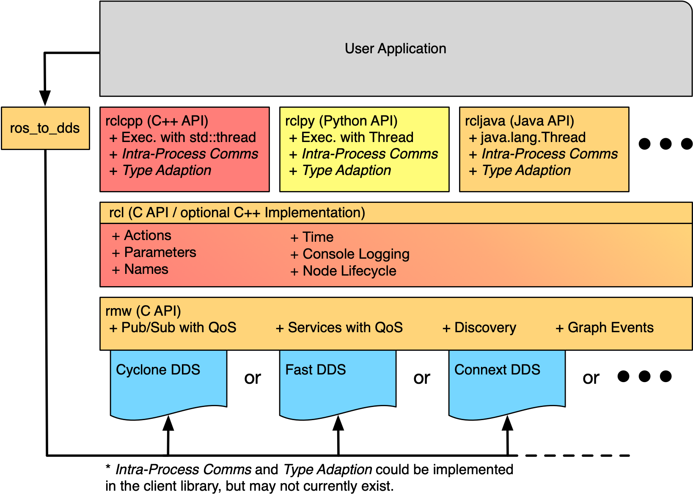
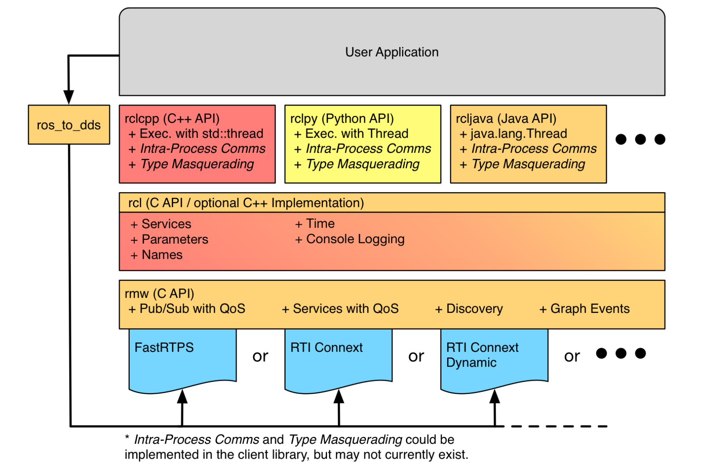
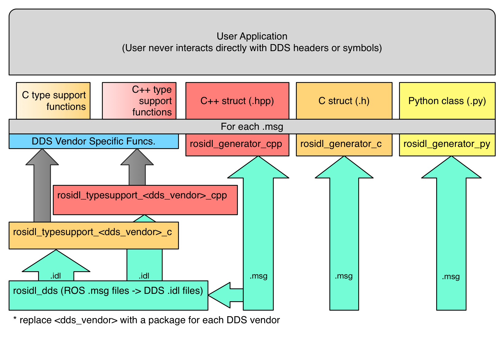
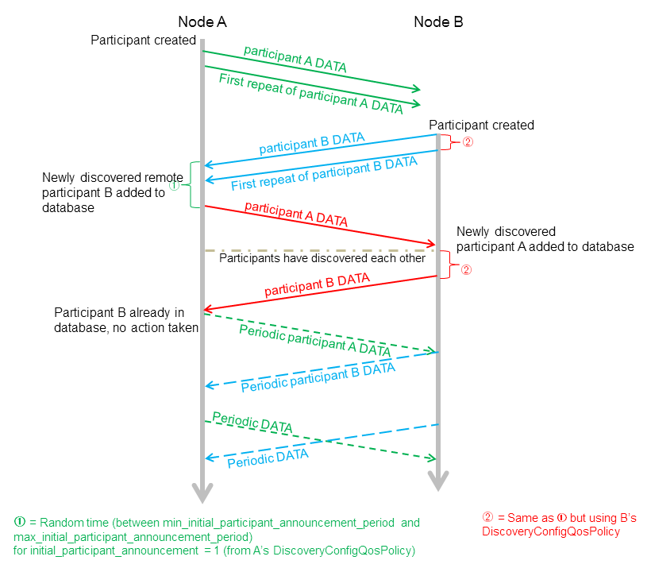

# ROS2 系统架构与 DDS 中间件架构详解

> 面向已经会基本 `ros2` 命令、正进入工程实践的读者。本文以 ROS 2 Humble 常见使用方式为基线组织内容；文中引用的 Kilted 文档只用于说明在现代 ROS 2 发行版中通用的机制，例如节点、QoS、执行器和内部接口，而不是引入 Humble 独有之外的新概念。

## 1. 先看全局

很多人第一次看 ROS 2 会把两类问题混在一起：

- “系统架构”在回答：应用代码、节点、Topic、Service、Action、Parameter、Executor、Composition 这些 ROS 2 概念是怎么协同工作的。
- “DDS 架构”在回答：这些 ROS 2 概念最后是怎样落到底层中间件上的，消息怎么被序列化、发现、匹配、发送和接收。

可以先把 ROS 2 理解成一套面向机器人分布式软件的运行时和通信框架，而不是传统意义上直接管理硬件资源的操作系统。官方文档把 `node` 定义为 ROS 2 graph 中的参与者，节点之间通过分布式发现自动建立连接；一个节点通常应该只做一件逻辑上的事情。[1][2]

从工程角度看，这两层问题最好分开理解：

| 视角 | 你真正关心的问题 | 关键词 |
| --- | --- | --- |
| 系统架构 | 我的系统该怎么拆节点？什么时候用 Topic、Service、Action？回调由谁调度？ | graph、node、executor、composition |
| 中间件架构 | 我的消息为什么能跨进程、跨机器收发？为什么有时“看得到 topic 但收不到消息”？ | `rcl`、`rmw`、DDS、QoS、discovery |

一个非常重要的总判断是：ROS 2 刻意把“机器人应用接口”和“具体中间件实现”隔开。设计文档明确说明，ROS 2 之所以在 client library 与具体 DDS 实现之间引入抽象接口，是为了支持多个 DDS 实现，并把 DDS 复杂性隔离在用户代码之外。[7]

## 2. 图1：系统架构

> 图 1：`Architecture.png`. 阅读时建议从上到下看：用户应用层 -> ROS client library -> `rcl` -> `rmw` -> 具体 DDS/RTPS 实现。

### 2.1 最上层：用户应用与 ROS 计算图

用户真正直接编程的地方通常是 `rclcpp`、`rclpy` 这样的 client library。它们把 ROS 2 中最核心的几个通信与运行时概念暴露给开发者：

- `Node`：计算单元，也是 graph 中的参与者。[1]
- `Topic`：连续数据流，典型用于传感器、状态、控制量。[3][12]
- `Service`：短时 RPC，请求-响应，应尽快返回。[4][12]
- `Action`：长时任务，带反馈、可取消、可抢占。[5][12]
- `Parameter`：节点级配置，生命周期绑定到节点本身。[6]

把这五个概念放在一起看，你会发现 ROS 2 不是只有“发消息”。它其实同时提供了：

- 连续流接口：Topic
- 快速请求-响应接口：Service
- 长时任务接口：Action
- 节点配置接口：Parameter

这正是 ROS 2 系统架构最核心的地方：它把机器人系统拆成很多个逻辑节点，再给节点之间提供不同语义的通信方式。

### 2.2 中间层：`rclcpp/rclpy` 为什么还不够，为什么还要有 `rcl`

官方内部接口文档说明，ROS 2 在内部主要有两层公共 C API：[8]

- `rcl`：更高一层的 ROS client library interface
- `rmw`：ROS middleware interface

`rcl` 的职责不是“再造一个 client library”，而是把多语言都共用的一些 ROS 逻辑集中起来。按照官方分层，它负责承接更高层的 ROS 概念和通用行为，例如图中的 actions、parameters、names、time、logging、lifecycle 等能力，然后再通过 `rmw` 去接触底层中间件。[8]

所以从职责边界上可以这样记：

| 层 | 主要职责 | 对开发者的意义 |
| --- | --- | --- |
| `rclcpp` / `rclpy` | 提供语言友好的用户 API | 你平时写节点主要接触这一层 |
| `rcl` | 提供跨语言共用的 ROS 语义与逻辑 | 保证 C++ / Python 等行为更一致 |
| `rmw` | 把 ROS 能力翻译成底层中间件能力 | 允许切换 Fast DDS / Cyclone DDS / Connext DDS 等 |

> 补充图 A：官方 `ros_client_library_api_stack`。这张图比 `Architecture.png` 更适合拿来解释 `rclcpp/rclpy -> rcl -> rmw -> DDS` 的职责边界。[8]

### 2.3 运行时调度：Executor 不是通信层，而是“回调调度层”

很多初学者会误以为“消息到了，回调自然就执行”。严格来说，中间还隔着 `Executor`。官方文档把执行管理定义为：Executor 使用一个或多个线程，去触发 subscription、timer、service server、action server 等回调。[10]

这意味着：

- DDS 负责发现、传输、QoS 约束下的数据可达性。
- Executor 负责在你的进程里“何时调用哪个回调”。

一个很关键的实现细节是：在 ROS 2 中，为了不破坏中间件的 QoS 语义，收到的消息不会先在 client library 层再复制出一个类似 ROS 1 的额外队列；Executor 通过 wait set 感知底层是否有消息可取，然后再触发回调。[10]

工程上这直接影响两个判断：

- 回调卡住，会拖慢同一 Executor 上的其他回调。
- “通了但处理不过来”不一定是网络问题，也可能是执行模型、线程数、callback group 配置问题。

> 补充图 B：官方 `executors_basic_principle`，适合配合上文理解“中间件负责有无数据，Executor 负责何时执行回调”。[10]

> 补充图 C：官方 `executors_scheduling_semantics`，可以帮助理解为什么单线程 Executor 下某个慢回调会影响其他回调。[10]

### 2.4 部署方式：Composition 让“进程边界”变成部署时决策

ROS 2 Composition 文档给出的核心思想是：同一套节点 API，既可以部署成多个独立进程，也可以把多个组件装进同一进程。[11]

这样做的好处是把“逻辑拆分”和“进程部署”解耦：

- 多进程：故障隔离更好，调试直观。
- 单进程组合：开销更低，必要时可获得更高效的进程内通信。[11]

因此在系统架构层面，节点的职责边界应优先按“逻辑”和“数据依赖”来定，而不是一开始就被进程边界绑死。

## 3. 工程视角：移动机器人系统该怎么拆

下面用一个典型移动机器人链路，把前面的系统架构落到工程决策上：

- 传感器驱动节点：相机、激光雷达、IMU、编码器
- 感知节点：目标检测、障碍物提取、点云预处理
- 状态估计/定位节点：里程计融合、SLAM、定位
- 规划节点：全局规划、局部规划
- 控制节点：轨迹跟踪、速度控制
- 执行器/底盘接口节点：把 `/cmd_vel` 或底盘指令下发给硬件
- 上层任务节点：导航到目标点、自动回充、巡检任务

### 3.1 为什么这样拆

如果按“一个节点只做一件逻辑事情”的原则，[1] 上面的拆法有三个直接好处：

- 复用性高：同一套定位节点可以接不同地图或不同传感器前端。
- 可观测性强：每条 Topic 都能被 `ros2 topic echo`、`ros2 bag`、RViz 单独观察。
- 失效边界清晰：控制卡死，不必连带把感知和任务调度一并拖死。

### 3.2 Topic、Service、Action 到底怎么选

官方 how-to 文档给出的原则非常适合直接当工程规范：[12]

| 场景 | 应选接口 | 为什么 |
| --- | --- | --- |
| 相机图像、激光雷达、IMU、里程计持续输出 | Topic | 连续数据流，多对多，发送和接收解耦 |
| 查询地图版本、请求一次 IK、重置定位、读取设备状态 | Service | 这是短时 RPC，调用方等待结果，应该尽快返回 |
| “去 2D 目标点”“执行回充”“跟随某条路径” | Action | 长时间执行，需要反馈、可取消、可能被新目标抢占 |
| `max_vel_x`、`use_sim_time`、阈值和开关量 | Parameter | 节点级配置，不属于数据流本身 |

再把官方定义压缩成一句话：

- Topic：持续流。
- Service：短平快请求。
- Action：长任务 + 反馈 + 取消/抢占。

另外还有一个容易忽略的约束：同一个 service name 或 action name，通常应只有一个 server；官方文档明确说明，如果多个 server 同名并存，请求会落到哪个 server 是未定义行为。[4][5]

### 3.3 一个具体链路示例

假设你在做室内移动机器人导航，可以按下面方式理解整条链：

1. `lidar_driver` 持续发布 `/scan`，这是 Topic。
2. `ekf_localization` 订阅 `/imu/data`、`/wheel_odom`，持续输出 `/odom`，这是 Topic。
3. `amcl` 或 SLAM 节点持续输出机器人位姿，这是 Topic。
4. `nav_manager` 接收“去某个点”的高层目标，这不应该是 Service，而更适合 Action，因为导航需要时间、需要反馈、还可能取消。[5][12]
5. `controller_server` 持续发布 `/cmd_vel` 给底盘，这仍然是 Topic，因为速度命令本质上是流。
6. 如果你想临时把最大速度从 `0.5` 改成 `0.3`，这通常不应设计成单独 Topic，而更适合 Parameter，因为它是在改节点配置。[6]

### 3.4 系统架构里最常见的三个误判

- 把长任务做成 Service：结果就是客户端长时间阻塞，也没有反馈，取消也困难。[4][5]
- 把配置做成 Topic：结果配置变更无法和节点生命周期、参数声明、参数描述符形成统一约束。[6]
- 把所有东西都塞进一个大节点：短期省事，长期会让调试、复用、故障定位都变差。[1]

## 4. 图2：DDS / 中间件架构

> 图 2：`API.png`. 理解这张图时，建议把“用户看见的消息类型”和“中间件真正发送的样本”分开看。

这一层的核心问题不是“该用什么接口”，而是“接口最终怎样被中间件实现出来”。

### 4.1 从 `rclcpp/rclpy` 到 `rcl` 再到 `rmw`

官方内部接口文档把分层讲得很清楚：[8]

- 用户直接使用的是 client library，例如 `rclcpp`、`rclpy`。
- client library 通过 `rcl` 获取 ROS graph、图事件以及一批通用 ROS 语义。
- `rcl` 再通过 `rmw` 去访问底层中间件。
- `rmw` 的具体实现由某个 vendor 对应的包提供，例如 `rmw_fastrtps_cpp`。

换句话说，ROS 2 应用并不直接调用 DDS API，而是走下面这条链：

`用户节点代码 -> rclcpp/rclpy -> rcl -> rmw_* -> DDS/RTPS 实现`

这条链的价值在于：

- 应用层写的是 ROS 概念，不是 DDS 细节。
- 更换 RMW 实现时，理想情况下不必重写上层节点代码。[7][9]

### 4.2 `.msg` 到网络报文，中间到底发生了什么

ROS 2 设计文档对消息流转给出了很清楚的描述：[7]

1. 用户在 `.msg` / `.srv` / `.action` 文件里定义接口。
2. `rosidl_generator_cpp`、`rosidl_generator_c`、`rosidl_generator_py` 生成各语言可直接使用的消息结构或类。[8]
3. 同时，系统还会生成与消息类型相关的 `type support` 代码。`type support` 的职责不是给你写业务逻辑，而是提供“如何理解这个消息结构并把它交给中间件”的元信息和函数入口。[7][8]
4. 当你在 `rclcpp` 或 `rclpy` 中 `publish(msg)` 时，client library 把 ROS 消息对象交给 `rcl`。
5. `rcl` 通过 `rmw` 调用具体中间件实现。
6. 具体 `rmw` 实现把 ROS 消息转换、序列化成底层中间件可发送的样本，然后由 DDS 发布出去。[7]
7. 接收端执行相反过程：DDS 收到样本，`rmw` 做反序列化或转换，再把 ROS 消息对象交给回调函数。[7]

因此，科学一点说，ROS 2 传输的不是“你的 C++ struct 原封不动过网线”，而是：

- 上层是语言相关的 ROS 消息对象。
- 中间通过 `type support` 和 `rmw` 变成中间件可处理的数据表示。
- 底层真正过网络的是 DDS/RTPS 意义上的样本和协议数据。

> 补充图 D：官方 `ros_idl_api_stack_static`。它把 `.msg/.srv/.action -> rosidl generator -> typesupport -> rmw` 这条链画得比本地总览图更细。[8]

### 4.3 `type support` 为什么这么关键

如果没有 `type support`，中间件层根本不知道：

- 这个 ROS 消息有哪些字段
- 每个字段是什么类型
- 如何把它转成可序列化格式
- 如何从中间件样本恢复成 ROS 消息对象

所以你可以把 `type support` 理解成“ROS 类型系统”和“中间件类型系统”之间的桥。

### 4.4 静态类型支持 vs 动态类型支持

官方内部接口文档还专门区分了两种路径：[8]

- 静态类型支持：为每个消息类型生成更具体、更偏 vendor 的代码。通常性能更高，但生成代码更多。
- 动态类型支持：更多依赖 introspection 元数据和通用函数，代码复用更好，但通常比静态方式慢一些；在 DDS 场景下，这通常要求底层支持类似 DDS-XTypes 的动态类型能力。[8]

工程上可以这样理解：

- 如果你追求高性能、成熟链路，常见路径是“静态 typesupport + 具体 DDS vendor 的 `rmw`”。
- 如果你更关心通用性、生成代码规模或运行时反射能力，动态/introspection 路径更值得关注。

### 4.5 一个发布-接收全过程

下面用一条 `/scan` 数据流把整个通路串起来：

1. `lidar_driver` 生成 `sensor_msgs/msg/LaserScan` 消息对象。
2. `rclcpp::Publisher<LaserScan>` 调用 `publish()`。
3. `rclcpp` 把请求下沉给 `rcl`。
4. `rcl` 调用当前选中的 `rmw` 实现。
5. `rmw` 结合 `LaserScan` 的 typesupport，把消息字段序列化成 DDS 可传输的样本。
6. DDS `DataWriter` 把样本发到网络。
7. 远端 DDS `DataReader` 收到样本并完成匹配与接收。
8. 远端 `rmw` 把样本还原成 ROS 消息对象。
9. `rcl` / `rclcpp` 把消息交给订阅回调，Executor 再决定什么时候执行这个回调。[7][8][10]

注意这里最后一步经常被忽略：消息“到达中间件”不等于“你的业务回调已经被执行”。

## 5. DDS 关键机制

讨论 ROS 2 的 DDS 架构时，最容易出错的地方，是把 ROS 2 概念和 DDS 实体当成完全一一对应。更稳妥的做法是：先理解 DDS 提供了哪些能力，再理解 ROS 2 怎样借助 `rmw` 使用这些能力。

### 5.1 DDS 提供的到底是什么

ROS 2 官方文档对 DDS 的概括很准确：DDS 是一种工业标准中间件，RTPS 是它的网络线协议；ROS 2 之所以基于 DDS/RTPS，核心收益是分布式发现和细粒度 QoS 控制。[9]

把 DDS 当成“更靠近传输层和发现层的通用数据分发平台”会比较好理解。它提供的核心能力包括：

- 分布式发现：节点上线后自动互相发现，不需要 ROS 1 那样的中心 master。[2][9]
- 发布订阅：数据可按类型和名字分发。
- 请求-响应能力：可支撑服务类通信。[8]
- QoS：可靠性、历史缓存、持久性、deadline、liveliness 等通信约束。[13]

### 5.2 Domain、Participant、Writer、Reader 应该怎么理解

在 DDS 里，最常见的几个实体是：

| DDS 实体 | 直观含义 | 在 ROS 2 里你可以怎样理解 |
| --- | --- | --- |
| Domain | 一组逻辑隔离的通信空间 | 常对应 `ROS_DOMAIN_ID` 控制的发现边界 |
| DomainParticipant | 一个进程/上下文加入某个 DDS domain 的代表实体 | 它负责参与发现并创建后续通信实体 |
| Topic | 带名字和类型的主题 | 与 ROS 2 的 topic 概念相近，但不直接暴露给普通用户 |
| Publisher / Subscriber | DDS 中对写端/读端的逻辑组织 | 提供 DataWriter / DataReader 的宿主语义 |
| DataWriter / DataReader | 真正执行发送/接收的端点 | 对 ROS 用户透明，通常由 `rmw` 隐藏 |

这里要特别强调一个严谨点：ROS 2 API 并不承诺这些 DDS 实体与 ROS 概念存在稳定的一一映射。官方设计文档的重点是“ROS 概念如何借助 DDS 能力实现”，而不是要求用户把 DDS 实体当成上层编程接口。设计文档明确指出，ROS API 并不直接暴露 DDS `DataReader`、`DataWriter` 与 DDS Topic；同时 ROS 只暴露少量 QoS 参数，其他 DDS 细节被藏在抽象层后面。[7]

所以更可靠的工程理解是：

- ROS 2 借用 DDS 的发现、发布订阅、服务和 QoS 能力。
- `rmw` 决定这些能力在具体 vendor 上怎么落地。
- 普通 ROS 节点开发者不应把 DDS 实体组织方式当成稳定 API 来依赖。

### 5.3 发现机制：为什么节点会“自动看见彼此”

ROS 2 Discovery 文档给出的流程非常清楚：[2]

1. 节点启动后，会向同一 ROS domain 中的其他节点通告自己的存在。
2. 其他节点回应自己的信息，以便建立合适连接。
3. 节点会周期性继续通告存在，以便后续加入的新实体也能完成发现。
4. 节点离线时也会对外通告。
5. 只有 QoS 兼容时，实体才真正建立连接。[2][13]

RTI 的 DDS 文档进一步说明了 participant discovery 的底层思路：当一个 `DomainParticipant` 被创建时，系统会自动创建用于交换 participant 信息的特殊 reader/writer，它们专门负责发现阶段的 participant DATA 消息交换。[14]

这两份材料放在一起看，ROS 2 的发现过程可以理解为两层：

- ROS 2 层：节点通过底层中间件自动发现同 domain 里的其他节点。[2]
- DDS 层：Participant 先发现彼此，再继续匹配后续通信实体。[14]

> 补充图 E：RTI Connext 文档里的 Participant Discovery 总结图。它很适合拿来配合“ROS 2 自动发现的底层其实依赖 DDS participant 级发现”这句话一起看。[14]

### 5.4 QoS：为什么 ROS 2 比 ROS 1 更灵活，也更容易“配错”

ROS 2 QoS 文档明确说明：QoS 由多个策略组成，发布端和订阅端只有在 QoS 兼容时才会连接。[13]

最关键的策略如下：

| QoS 策略 | 含义 | 工程上最常见的理解 |
| --- | --- | --- |
| History | 保存多少历史样本 | `keep last` 最常用 |
| Depth | 队列深度 | 只在 `keep last` 下生效 |
| Reliability | `best effort` 或 `reliable` | 传感器常偏前者，控制/状态常偏后者 |
| Durability | `volatile` 或 `transient local` | 后者可支持“晚加入者拿到旧样本” |
| Deadline | 两次发布最大允许间隔 | 适合周期任务监测 |
| Lifespan | 消息最大有效期 | 过期消息会被静默丢弃 |
| Liveliness / Lease Duration | 发布者活性及其租约 | 故障感知和监测相关 |

官方还给出了若干非常关键的兼容性规则：[13]

- 订阅端 `reliable`，发布端 `best effort`：不兼容。
- 订阅端 `best effort`，发布端 `reliable`：兼容。
- 订阅端 `transient local`，发布端 `volatile`：不兼容。
- 发布端和订阅端都使用 `transient local` 时，晚加入者才能拿到旧消息。[13]

这就是为什么工程里经常会遇到下面这种情况：

- `ros2 topic list` 能看到 topic
- 类型也没错
- 但就是收不到消息

原因往往不是“网络断了”，而是：

- `ROS_DOMAIN_ID` 不同
- QoS 不兼容
- 订阅端要求比发布端更严格

### 5.5 官方 QoS profile 和工程建议要分开看

官方预定义 profile 给了几个常见方向：[13]

- 默认 pub/sub：`keep last` + depth 10 + `reliable` + `volatile`
- services：可靠，且尤其强调使用 `volatile`
- sensor data：更强调及时性，因此通常使用 `best effort` 与较小 queue depth
- parameters：基于 services，但 queue depth 更大

在项目里，我建议把“官方 profile”和“工程建议”分开看：

- 官方 profile 是协议与生态层面已经共识化的默认起点。[13]
- 具体机器人链路怎么调，是工程推断，不是 ROS 2 规范。

基于官方 profile 和常见机器人系统，我建议的经验起点是：

| 场景 | 建议起点 | 说明 |
| --- | --- | --- |
| 激光、相机、IMU | `best effort` + 小 depth | 优先最新数据，允许少量丢包 |
| 关键状态、控制反馈 | `reliable` + `keep last` | 更重视正确送达 |
| 地图、静态配置、一次性状态快照 | `transient local` | 方便晚加入者拿到最近状态 |
| Service / 参数服务 | 直接用系统默认 service / parameter profile | 不要随意自定义成“像 topic 一样” |

上表是工程建议，不是官方强制规则；真正落地时仍要以链路实时性、网络质量和上下游节点兼容性为准。

### 5.6 Vendor 差异到底落在哪一层

官方 vendor 文档指出，ROS 2 支持多个中间件实现；虽然主流仍然是 DDS/RTPS，但抽象层存在的根本原因就是“不让上层应用被某个 vendor 绑死”。[9]

设计文档也明确说了，不同 DDS 实现的差异主要体现在：

- 支持平台
- 编程语言支持
- 性能特征
- 内存占用
- 依赖
- 许可方式[7]

从这两份材料可以推断出，vendor 差异主要影响的是：

- discovery 行为和可调参数
- 默认 QoS 与 XML 配置方式
- 延迟、吞吐、内存占用和大消息传输表现
- 诊断工具链和运维方式

而理想情况下，不应该影响：

- 你对 `rclcpp` / `rclpy` 的基本使用方式
- 你对 Topic / Service / Action / Parameter 的系统级建模方式

只有当你开始显式依赖 vendor 专属 XML、`ros_to_dds` 风格桥接包，或直接操作 vendor 对象时，应用才会明显失去可移植性。[8]

## 6. 落地清单：接口选型、QoS 速查、常见误区

### 6.1 接口选型清单

当你准备新增一个节点接口时，可以按下面顺序判断：

1. 这是连续数据流吗？
   - 是：优先 Topic。[3][12]
2. 这是一次调用，且应该很快返回吗？
   - 是：优先 Service。[4][12]
3. 这是长时间运行任务，而且需要反馈或取消吗？
   - 是：优先 Action。[5][12]
4. 这是节点配置，而不是通信数据吗？
   - 是：优先 Parameter。[6]

### 6.2 QoS 速查清单

遇到“链路不通”时，按下面顺序排查最省时间：

1. 两端 `ROS_DOMAIN_ID` 是否一致。[2]
2. Topic 名和消息类型是否完全一致。
3. 发布端和订阅端 QoS 是否兼容，尤其先看 `reliability` 与 `durability`。[13]
4. 是否误用了 `system default`，导致不同 RMW implementation 的默认值不同。[13]
5. 如果是单机大吞吐链路，再看具体 vendor 的 XML 或 tuning 选项。[9]

最实用的几条命令通常是：

- `echo $ROS_DOMAIN_ID`：先确认不在不同 domain 里各说各话。
- `echo $RMW_IMPLEMENTATION`：确认当前到底用了哪个中间件实现。
- `ros2 topic info -v /your_topic`：看类型、端点和 QoS。
- `ros2 node info /your_node`：看节点到底暴露了哪些 topic / service / action。
- `ros2 doctor --report`：环境和依赖异常时先做体检。

### 6.3 Executor / Composition 速查清单

如果你感觉“消息明明到了，但系统表现还是不对”，要检查的通常不是 DDS，而是执行模型：

- 是否把多个重回调挂在单线程 Executor 上了。[10]
- 是否需要 `MultiThreadedExecutor` 或更合理的 callback group。[10]
- 是否该把多个节点组合进同一进程以减少开销，还是保持多进程以获得故障隔离。[11]

### 6.4 常见误区

| 现象 | 常见根因 | 更合理的理解 |
| --- | --- | --- |
| 能看到 topic，但没数据 | QoS 不兼容 / domain 不同 | “发现成功”不等于“连接成功” |
| Service 经常卡住 | 拿 Service 做长任务 | 长任务应该迁移为 Action |
| 同名 Service / Action 行为诡异 | 存在多个同名 server | 这在官方语义里是未定义行为，应保持一个名字只有一个 server |
| 想给晚启动节点补发最近一次地图 | 仍在用 `volatile` | 应考虑 `transient local` |
| 切换 DDS vendor 后行为变化 | 依赖了 vendor 默认值或专属 XML | `system default` 不是跨 vendor 统一规范 |
| 多节点合并后还是不快 | 忽略了 Executor、callback group、进程内通信条件 | Composition 不是自动性能魔法 |

### 6.5 总结

> ROS 2 的系统架构决定“你的机器人软件该怎么建模”，而 DDS / `rmw` 架构决定“这些模型如何被可靠地搬到进程、主机和网络之间”。

前者关心的是节点职责和接口语义，后者关心的是发现、序列化、匹配和 QoS。把这两层分开，ROS 2 就会一下清楚很多。

---

## 参考资料

[1] Nodes. https://docs.ros.org/en/kilted/Concepts/Basic/About-Nodes.html

[2] Discovery. https://docs.ros.org/en/kilted/Concepts/Basic/About-Discovery.html

[3] Topics. https://docs.ros.org/en/kilted/Concepts/Basic/About-Topics.html

[4] Services. https://docs.ros.org/en/kilted/Concepts/Basic/About-Services.html

[5] Actions. https://docs.ros.org/en/kilted/Concepts/Basic/About-Actions.html

[6] Parameters. https://docs.ros.org/en/kilted/Concepts/Basic/About-Parameters.html

[7] ROS 2 middleware interface. https://design.ros2.org/articles/ros_middleware_interface.html

[8] Internal ROS 2 interfaces. https://docs.ros.org/en/kilted/Concepts/Advanced/About-Internal-Interfaces.html

[9] Different ROS 2 middleware vendors. https://docs.ros.org/en/kilted/Concepts/Intermediate/About-Different-Middleware-Vendors.html

[10] Executors. https://docs.ros.org/en/kilted/Concepts/Intermediate/About-Executors.html

[11] Composition. https://docs.ros.org/en/kilted/Concepts/Intermediate/About-Composition.html

[12] Topics vs Services vs Actions. https://docs.ros.org/en/kilted/How-To-Guides/Topics-Services-Actions.html

[13] Quality of Service settings. https://docs.ros.org/en/kilted/Concepts/Intermediate/About-Quality-of-Service-Settings.html

[14] Participant Discovery, RTI Connext DDS Users Manual. https://community.rti.com/static/documentation/connext-dds/current/doc/manuals/connext_dds_professional/users_manual/users_manual/Participant_Discovery.htm
