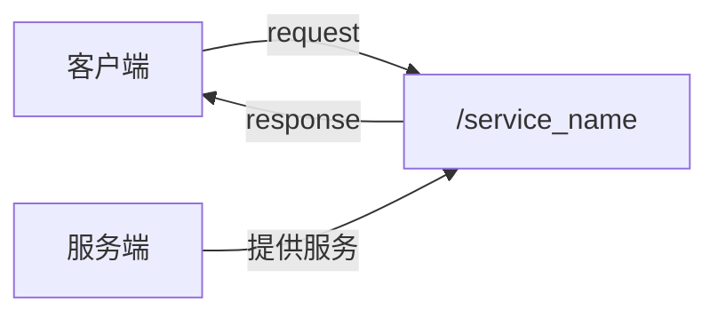
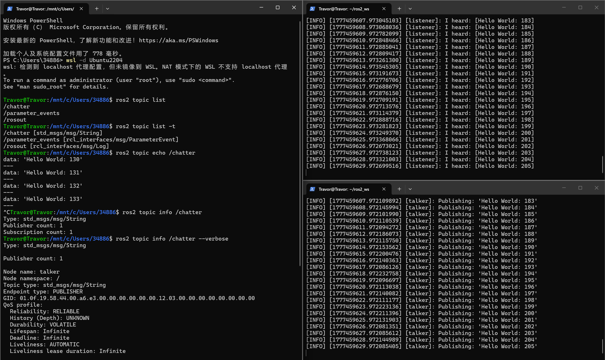
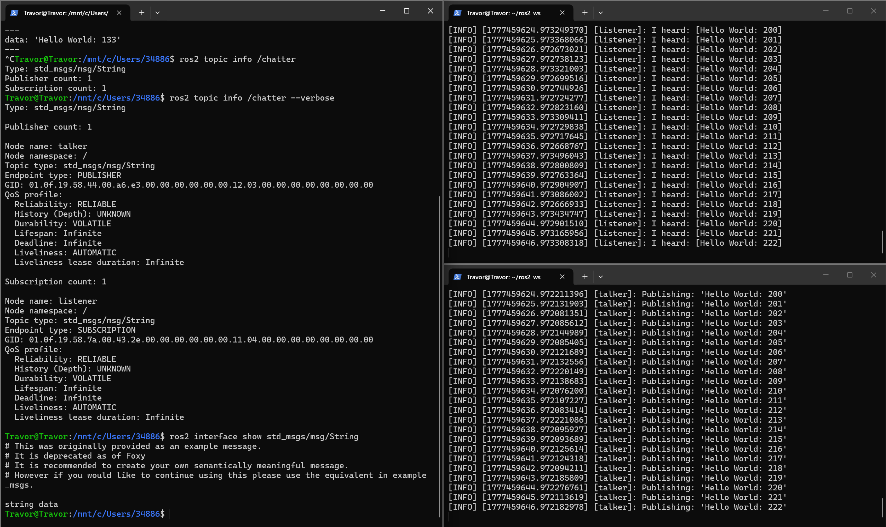
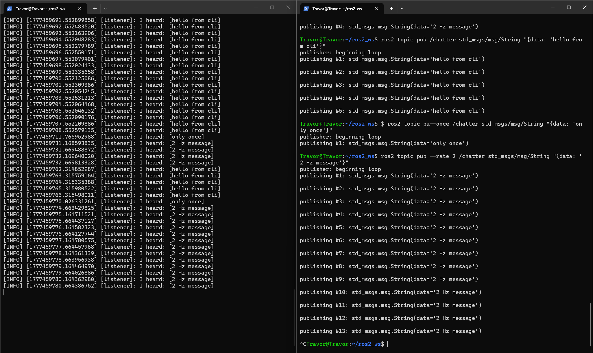
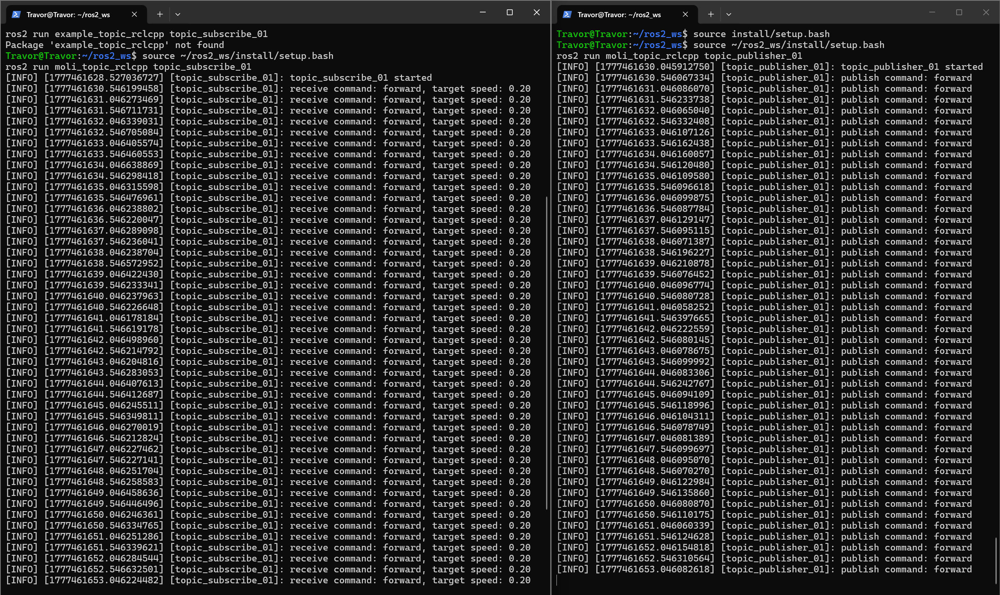
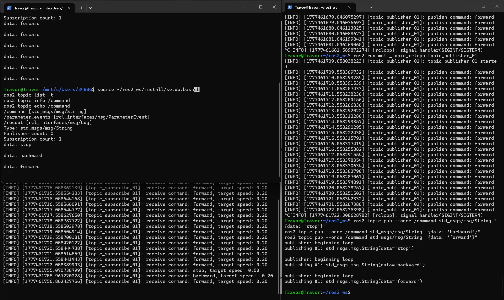
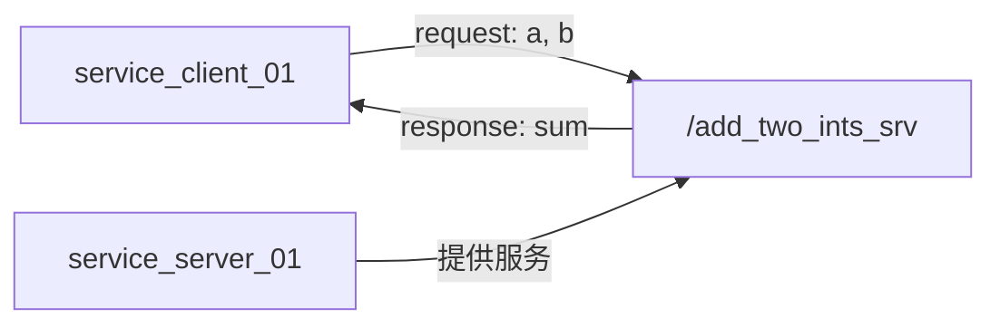

# ROS2 节点通信之话题与服务

> 适用环境：WSL2 + Ubuntu 22.04 + ROS2 Humble  

## 导读：这篇文章怎么用

上一篇《ROS2第一个节点》已经把 ROS2 的入门地基铺好了：环境检查、`talker/listener`、workspace、package、最小 Python/C++ 节点、`parameters/launch/bag/action` 的初识。

所以这一篇不再重复讲“ROS2 怎么装、workspace 是什么、最小节点怎么写”。本篇只做一件事：把“节点之间怎么通信”拆开讲透。

这一章的核心对象有两个：

- `topic`：发布订阅模型，适合连续数据流
- `service`：请求响应模型，适合一次性查询或触发

建议按顺序学：

1. 先用命令行观察 topic 和 service
2. 再分别用 C++ / Python 写 topic 发布者和订阅者
3. 再分别用 C++ / Python 写 service 服务端和客户端
4. 最后理解接口类型、构建配置和常见错误

### 和上一篇的边界

| 内容 | 放在哪里讲 |
| --- | --- |
| ROS2 环境、WSL 路径、`source` 是什么 | 第一篇 |
| workspace、package、executable、node 的关系 | 第一篇 |
| 最小 Python / C++ 节点结构 | 第一篇 |
| topic / service 的通信模型、CLI 深入、代码实现 | 本篇 |
| 参数、launch、bag、action 的初识 | 第一篇 |
| 自定义 msg / srv 接口 | 后续接口专项 |

读这一篇时，如果遇到 `colcon build`、`setup.py`、`CMakeLists.txt`、`ros2 run` 的基础概念卡住，先回看第一篇对应章节；如果只是通信命令或代码细节卡住，就直接看本篇的“常见问题”。

## 1. 目标

- 理解 topic 的发布订阅模型
- 理解 service 的请求响应模型
- 会用 `ros2 topic` 系列命令观察、打印、手动发布数据
- 会用 `ros2 service` 系列命令查看、调用服务
- 会用 `ros2 interface show` 查看消息和服务接口定义
- 用 `rclcpp` 写出 C++ topic 发布者和订阅者
- 用 `rclpy` 写出 Python topic 发布者和订阅者
- 用 `rclcpp` 写出 C++ service 服务端和客户端
- 用 `rclpy` 写出 Python service 服务端和客户端
- 知道 `CMakeLists.txt`、`package.xml`、`setup.py` 为什么要配置依赖和入口

## 2. 主线

1. 用 `/chatter` 作为实验基线深入 topic CLI
2. 从 topic CLI 追到消息接口定义
3. 用 C++ 实现 `/command` 话题发布订阅
4. 用 Python 实现 `/command` 话题发布订阅
5. 用 `add_two_ints` 作为实验基线深入 service CLI
6. 从 service CLI 追到请求和响应接口定义
7. 用 C++ 实现两数相加服务
8. 用 Python 实现两数相加服务
9. 总结 topic 和 service 的选择方法

### 本篇完成后的检查点

学完之后，至少应该能独立回答这几个问题：

- 为什么 `/command` 两边都要写成 `std_msgs/msg/String`
- `ros2 topic echo` 为什么能看到别人发的数据
- `ros2 topic pub` 为什么可以临时代替发布节点
- service 接口里 `---` 上下两部分分别代表什么
- 为什么 service 客户端通常要先 `wait_for_service`
- C++ 包里 `package.xml`、`find_package`、`ament_target_dependencies` 分别解决什么问题
- Python 包里为什么必须改 `setup.py` 的 `entry_points`

## 3. 前置约定

这篇笔记默认复用上一篇已经建好的工作空间：

```bash
cd ~/ros2_ws
```

每个新终端先加载工作空间环境：

```bash
source install/setup.bash
```

如果当前终端还没有加载过 ROS2 系统环境，可以先执行：

```bash
source /opt/ros/humble/setup.bash
```

本篇会新建 4 个学习包：

| 包名 | 语言 | 主题 |
| --- | --- | --- |
| `example_topic_rclcpp` | C++ | topic 发布订阅 |
| `example_topic_rclpy` | Python | topic 发布订阅 |
| `example_service_rclcpp` | C++ | service 服务端客户端 |
| `example_service_rclpy` | Python | service 服务端客户端 |

它们都放在：

```text
~/ros2_ws/src
```

这一篇的学习目标不是“创建更多最小节点”，而是把最小节点扩展成带通信能力的节点。

## 4. 通信模型先建立起来

### 4.1 topic：发布订阅

`topic` 可以理解成一个数据频道。

一个节点把数据发布到某个 topic 上，另一个节点订阅这个 topic，就能收到数据。


topic 的特点：

- 发布者不关心谁在接收
- 订阅者不关心谁在发布
- 一个 topic 可以有多个发布者
- 一个 topic 可以有多个订阅者
- 适合持续变化的数据，例如图像、雷达、里程计、速度指令、状态信息

### 4.2 service：请求响应

`service` 可以理解成一个远程函数调用。

客户端发出请求，服务端处理后返回响应。



service 的特点：

- 有明确的请求和响应
- 客户端需要知道服务是否存在
- 同名 service 通常只应该有一个服务端
- 可以有多个客户端调用同一个服务
- 适合短操作，例如查询状态、触发重置、计算结果、保存地图

### 4.3 一句话区分

| 通信方式 | 模型 | 适合场景 |
| --- | --- | --- |
| topic | 一直发，谁订阅谁收 | 连续数据流 |
| service | 问一次，答一次 | 短时请求响应 |
| action | 发目标，收反馈，等结果 | 长任务，例如导航 |

## 5. topic CLI：从 `/chatter` 看懂通信

### 5.1 实验基线

第一篇已经跑通过官方 `talker/listener`：

- `/talker` 发布 `std_msgs/msg/String` 到 `/chatter`
- `/listener` 订阅 `/chatter`

本节不再重复解释 `ros2 run demo_nodes_cpp talker` 和 `ros2 run demo_nodes_py listener` 的含义，只把它们当作一个稳定的观察对象。

如果当前没有运行这两个节点，可以临时开两个终端启动：

```bash
ros2 run demo_nodes_cpp talker
ros2 run demo_nodes_py listener
```

然后另开一个终端做下面的 CLI 观察。

### 5.2 先看“有哪些话题”

```bash
ros2 topic list
```

输出：

```text
/chatter
/parameter_events
/rosout
```

这一条命令只告诉我们“有什么 topic”，但还不知道每个 topic 上传的消息长什么样。

### 5.3 再看“话题类型是什么”

```bash
ros2 topic list -t
```

输出：

```text
/chatter [std_msgs/msg/String]
/parameter_events [rcl_interfaces/msg/ParameterEvent]
/rosout [rcl_interfaces/msg/Log]
```

这里最关键的是：

```text
/chatter [std_msgs/msg/String]
```

它说明 `/chatter` 话题上传输的数据类型是 `std_msgs/msg/String`。

这一步比单纯 `ros2 topic list` 更重要，因为写代码时发布者和订阅者必须使用同一个消息类型。

### 5.4 实时打印话题数据

```bash
ros2 topic echo /chatter
```

输出类似：

```text
data: 'Hello World: 10'
---
data: 'Hello World: 11'
---
data: 'Hello World: 12'
---
```

`ros2 topic echo` 本质上是临时创建了一个订阅者，订阅 `/chatter` 并把收到的数据打印出来。



### 5.5 查看发布者和订阅者数量

```bash
ros2 topic info /chatter
```

输出类似：

```text
Type: std_msgs/msg/String
Publisher count: 1
Subscription count: 1
```

这说明：

- 数据类型是 `std_msgs/msg/String`
- 当前有 1 个发布者
- 当前有 1 个订阅者

如果想看到更详细的信息：

```bash
ros2 topic info /chatter --verbose
```

### 5.6 追到接口定义

```bash
ros2 interface show std_msgs/msg/String
```

输出核心内容：

```text
string data
```

这说明 `std_msgs/msg/String` 这个消息里只有一个字段：

- 字段名：`data`
- 字段类型：`string`

所以 Python 里会写：

```python
msg.data = "hello"
```

C++ 里会写：

```cpp
message.data = "hello";
```

这一节真正要建立的意识是：topic 名称只解决“发到哪里”，接口类型才决定“发的东西长什么样”。



### 5.7 手动扮演发布者

先关掉 `/talker`，保留 `/listener`，然后用命令行直接往 `/chatter` 发消息：

```bash
ros2 topic pub /chatter std_msgs/msg/String "{data: 'hello from cli'}"
```

`listener` 终端应该能收到命令行发布的数据。

如果只想发布一次：

```bash
ros2 topic pub --once /chatter std_msgs/msg/String "{data: 'only once'}"
```

如果想指定频率：

```bash
ros2 topic pub --rate 2 /chatter std_msgs/msg/String "{data: '2 Hz message'}"
```

这条命令非常适合调试订阅者：当我们还没有写好发布节点时，可以先用 CLI 假装自己是发布者。



### 5.8 topic 常用命令速查

```bash
ros2 topic list
ros2 topic list -t
ros2 topic echo /topic_name
ros2 topic info /topic_name
ros2 topic info /topic_name --verbose
ros2 topic hz /topic_name
ros2 topic bw /topic_name
ros2 topic pub /topic_name msg_type "{field: value}"
ros2 interface show msg_type
```

## 6. C++ 实现 topic 发布订阅

### 6.1 这一节要做什么

我们写两个 C++ 节点：

- `topic_publisher_01`：每 0.5 秒发布一条控制指令到 `/command`
- `topic_subscribe_01`：订阅 `/command`，收到指令后打印对应速度

通信关系：


### 6.2 创建 C++ 包

```bash
cd ~/ros2_ws/src
ros2 pkg create example_topic_rclcpp --build-type ament_cmake --dependencies rclcpp std_msgs
```

创建源文件：

```bash
cd ~/ros2_ws/src/example_topic_rclcpp
touch src/topic_publisher_01.cpp
touch src/topic_subscribe_01.cpp
```

目录结构：

```text
example_topic_rclcpp/
├── CMakeLists.txt
├── include/
│   └── example_topic_rclcpp/
├── package.xml
└── src/
    ├── topic_publisher_01.cpp
    └── topic_subscribe_01.cpp
```

### 6.3 写 C++ 发布者

编辑：

```text
~/ros2_ws/src/example_topic_rclcpp/src/topic_publisher_01.cpp
```

写入：

```cpp
#include <chrono>
#include <memory>
#include <string>

#include "rclcpp/rclcpp.hpp"
#include "std_msgs/msg/string.hpp"

using namespace std::chrono_literals;

class TopicPublisher01 : public rclcpp::Node
{
public:
  TopicPublisher01() : Node("topic_publisher_01")
  {
    command_publisher_ = this->create_publisher<std_msgs::msg::String>("command", 10);
    timer_ = this->create_wall_timer(500ms, std::bind(&TopicPublisher01::timer_callback, this));
    RCLCPP_INFO(this->get_logger(), "topic_publisher_01 已启动");
  }

private:
  void timer_callback()
  {
    std_msgs::msg::String message;
    message.data = "forward";

    command_publisher_->publish(message);
    RCLCPP_INFO(this->get_logger(), "发布指令: %s", message.data.c_str());
  }

  rclcpp::Publisher<std_msgs::msg::String>::SharedPtr command_publisher_;
  rclcpp::TimerBase::SharedPtr timer_;
};

int main(int argc, char ** argv)
{
  rclcpp::init(argc, argv);
  auto node = std::make_shared<TopicPublisher01>();
  rclcpp::spin(node);
  rclcpp::shutdown();
  return 0;
}
```

### 6.4 发布者代码理解

最关键的三行是：

```cpp
command_publisher_ = this->create_publisher<std_msgs::msg::String>("command", 10);
timer_ = this->create_wall_timer(500ms, std::bind(&TopicPublisher01::timer_callback, this));
command_publisher_->publish(message);
```

含义：

- `create_publisher<std_msgs::msg::String>`：创建一个 String 类型发布者
- `"command"`：话题名称，实际完整名称是 `/command`
- `10`：队列长度，常见写法，表示保留最近 10 条待处理消息
- `create_wall_timer(500ms, ...)`：每 500ms 调一次回调函数
- `publish(message)`：真正把消息发出去

### 6.5 写 C++ 订阅者

编辑：

```text
~/ros2_ws/src/example_topic_rclcpp/src/topic_subscribe_01.cpp
```

写入：

```cpp
#include <memory>
#include <string>

#include "rclcpp/rclcpp.hpp"
#include "std_msgs/msg/string.hpp"

class TopicSubscribe01 : public rclcpp::Node
{
public:
  TopicSubscribe01() : Node("topic_subscribe_01")
  {
    command_subscription_ = this->create_subscription<std_msgs::msg::String>(
      "command",
      10,
      std::bind(&TopicSubscribe01::command_callback, this, std::placeholders::_1));

    RCLCPP_INFO(this->get_logger(), "topic_subscribe_01 已启动");
  }

private:
  void command_callback(const std_msgs::msg::String::SharedPtr msg)
  {
    double speed = 0.0;

    if (msg->data == "forward") {
      speed = 0.2;
    } else if (msg->data == "backward") {
      speed = -0.2;
    } else if (msg->data == "stop") {
      speed = 0.0;
    }

    RCLCPP_INFO(this->get_logger(), "收到指令: %s, 目标速度: %.2f", msg->data.c_str(), speed);
  }

  rclcpp::Subscription<std_msgs::msg::String>::SharedPtr command_subscription_;
};

int main(int argc, char ** argv)
{
  rclcpp::init(argc, argv);
  auto node = std::make_shared<TopicSubscribe01>();
  rclcpp::spin(node);
  rclcpp::shutdown();
  return 0;
}
```

### 6.6 订阅者代码理解

最关键的是：

```cpp
command_subscription_ = this->create_subscription<std_msgs::msg::String>(
  "command",
  10,
  std::bind(&TopicSubscribe01::command_callback, this, std::placeholders::_1));
```

含义：

- 订阅 `command` 话题
- 消息类型必须和发布者一致，都是 `std_msgs::msg::String`
- 收到消息时调用 `command_callback`
- `_1` 表示把收到的消息作为第一个参数传给回调函数

### 6.7 修改 `CMakeLists.txt`

编辑：

```text
~/ros2_ws/src/example_topic_rclcpp/CMakeLists.txt
```

确认有：

```cmake
find_package(ament_cmake REQUIRED)
find_package(rclcpp REQUIRED)
find_package(std_msgs REQUIRED)

add_executable(topic_publisher_01 src/topic_publisher_01.cpp)
ament_target_dependencies(topic_publisher_01 rclcpp std_msgs)

add_executable(topic_subscribe_01 src/topic_subscribe_01.cpp)
ament_target_dependencies(topic_subscribe_01 rclcpp std_msgs)

install(TARGETS
  topic_publisher_01
  topic_subscribe_01
  DESTINATION lib/${PROJECT_NAME}
)

ament_package()
```

如果 `ros2 pkg create` 已经生成了部分内容，不要重复写 `find_package` 和 `ament_package()`，只需要把缺的目标补进去。

### 6.8 检查 `package.xml`

创建包时已经带了依赖，但可以确认一下：

```xml
<depend>rclcpp</depend>
<depend>std_msgs</depend>
```

### 6.9 构建

```bash
cd ~/ros2_ws
colcon build --packages-select example_topic_rclcpp
source install/setup.bash
```

### 6.10 运行测试

终端 A：运行订阅者

```bash
source ~/ros2_ws/install/setup.bash
ros2 run example_topic_rclcpp topic_subscribe_01
```

终端 B：运行发布者

```bash
source ~/ros2_ws/install/setup.bash
ros2 run example_topic_rclcpp topic_publisher_01
```

终端 C：观察 topic

```bash
source ~/ros2_ws/install/setup.bash
ros2 topic list -t
ros2 topic info /command
ros2 topic echo /command
```



### 6.11 用命令行测试订阅者

只运行订阅者，然后手动发布：

```bash
ros2 topic pub --once /command std_msgs/msg/String "{data: 'stop'}"
ros2 topic pub --once /command std_msgs/msg/String "{data: 'backward'}"
ros2 topic pub --once /command std_msgs/msg/String "{data: 'forward'}"
```

这样可以单独验证订阅者逻辑，不需要每次都启动发布者。



## 7. Python 实现 topic 发布订阅

### 7.1 这一节要做什么

我们再写两个 Python 节点，实现同样的 `/command` 话题通信：

- `topic_publisher_02`：发布 `backward`
- `topic_subscribe_02`：订阅并打印速度

### 7.2 创建 Python 包

```bash
cd ~/ros2_ws/src
ros2 pkg create example_topic_rclpy --build-type ament_python --dependencies rclpy std_msgs
```

创建节点文件：

```bash
cd ~/ros2_ws/src/example_topic_rclpy/example_topic_rclpy
touch topic_publisher_02.py
touch topic_subscribe_02.py
```

### 7.3 写 Python 发布者

编辑：

```text
~/ros2_ws/src/example_topic_rclpy/example_topic_rclpy/topic_publisher_02.py
```

写入：

```python
#!/usr/bin/env python3

import rclpy
from rclpy.node import Node
from std_msgs.msg import String


class TopicPublisher02(Node):
    def __init__(self):
        super().__init__("topic_publisher_02")
        self.command_publisher = self.create_publisher(String, "command", 10)
        self.timer = self.create_timer(0.5, self.timer_callback)
        self.get_logger().info("topic_publisher_02 已启动")

    def timer_callback(self):
        msg = String()
        msg.data = "backward"
        self.command_publisher.publish(msg)
        self.get_logger().info(f"发布指令: {msg.data}")


def main(args=None):
    rclpy.init(args=args)
    node = TopicPublisher02()
    rclpy.spin(node)
    node.destroy_node()
    rclpy.shutdown()
```

### 7.4 写 Python 订阅者

编辑：

```text
~/ros2_ws/src/example_topic_rclpy/example_topic_rclpy/topic_subscribe_02.py
```

写入：

```python
#!/usr/bin/env python3

import rclpy
from rclpy.node import Node
from std_msgs.msg import String


class TopicSubscribe02(Node):
    def __init__(self):
        super().__init__("topic_subscribe_02")
        self.command_subscription = self.create_subscription(
            String,
            "command",
            self.command_callback,
            10,
        )
        self.get_logger().info("topic_subscribe_02 已启动")

    def command_callback(self, msg):
        speed = 0.0

        if msg.data == "forward":
            speed = 0.2
        elif msg.data == "backward":
            speed = -0.2
        elif msg.data == "stop":
            speed = 0.0

        self.get_logger().info(f"收到指令: {msg.data}, 目标速度: {speed:.2f}")


def main(args=None):
    rclpy.init(args=args)
    node = TopicSubscribe02()
    rclpy.spin(node)
    node.destroy_node()
    rclpy.shutdown()
```

### 7.5 修改 `setup.py`

编辑：

```text
~/ros2_ws/src/example_topic_rclpy/setup.py
```

把 `entry_points` 改成：

```python
entry_points={
    "console_scripts": [
        "topic_publisher_02 = example_topic_rclpy.topic_publisher_02:main",
        "topic_subscribe_02 = example_topic_rclpy.topic_subscribe_02:main",
    ],
},
```

### 7.6 检查 `package.xml`

确认有：

```xml
<depend>rclpy</depend>
<depend>std_msgs</depend>
```

### 7.7 构建

```bash
cd ~/ros2_ws
colcon build --packages-select example_topic_rclpy --symlink-install
source install/setup.bash
```

### 7.8 运行测试

终端 A：运行订阅者

```bash
source ~/ros2_ws/install/setup.bash
ros2 run example_topic_rclpy topic_subscribe_02
```

终端 B：运行发布者

```bash
source ~/ros2_ws/install/setup.bash
ros2 run example_topic_rclpy topic_publisher_02
```

终端 C：观察：

```bash
source ~/ros2_ws/install/setup.bash
ros2 node list
ros2 topic info /command
ros2 topic echo /command
```

### 7.9 混合测试

因为 C++ 和 Python 用的是同一个接口 `std_msgs/msg/String`，所以可以混着跑：

```bash
# C++ 发布，Python 订阅
ros2 run example_topic_rclcpp topic_publisher_01
ros2 run example_topic_rclpy topic_subscribe_02
```

或者：

```bash
# Python 发布，C++ 订阅
ros2 run example_topic_rclpy topic_publisher_02
ros2 run example_topic_rclcpp topic_subscribe_01
```

这正是 ROS2 接口机制的价值：只要 topic 名称和接口类型一致，不同语言写的节点也能通信。

## 8. topic 这一段的关键概念

### 8.1 话题名称要一致

发布者：

```cpp
create_publisher<std_msgs::msg::String>("command", 10)
```

订阅者：

```cpp
create_subscription<std_msgs::msg::String>("command", 10, callback)
```

它们都使用 `"command"`，所以会连到同一个 `/command`。

### 8.2 消息类型要一致

同一个 topic 上，发布者和订阅者必须使用相同的接口类型。

正确：

```text
/command [std_msgs/msg/String]
```

发布者和订阅者都用 `std_msgs/msg/String`。

错误例子：

```text
发布者：std_msgs/msg/String
订阅者：geometry_msgs/msg/Twist
```

这种情况下两边不会正常通信。

### 8.3 `std_msgs/msg/String` 适合学习，不适合复杂业务

`String` 很适合做入门 demo，但真实机器人里一般会用语义更明确的接口，例如：

- `geometry_msgs/msg/Twist`：速度控制
- `sensor_msgs/msg/Image`：图像
- `sensor_msgs/msg/LaserScan`：激光雷达
- `nav_msgs/msg/Odometry`：里程计

### 8.4 topic 调试顺序

以后 topic 不通时，不要一上来就改代码。按这个顺序查，效率最高：

1. 节点是否真的启动：

```bash
ros2 node list
```

2. 话题是否真的出现：

```bash
ros2 topic list -t
```

3. 话题类型是否符合预期：

```bash
ros2 topic info /command
```

4. 数据是否真的在流动：

```bash
ros2 topic echo /command
ros2 topic hz /command
```

5. 单独测试订阅者：

```bash
ros2 topic pub --once /command std_msgs/msg/String "{data: 'forward'}"
```

这套顺序的好处是：先确认 ROS2 图里的事实，再判断代码逻辑，避免凭感觉改来改去。

## 9. service 入门：用命令行看懂服务

### 9.1 启动官方服务端

终端 A：

```bash
source /opt/ros/humble/setup.bash
ros2 run examples_rclpy_minimal_service service
```

这个示例提供一个两数相加服务。

### 9.2 查看服务列表

终端 B：

```bash
source /opt/ros/humble/setup.bash
ros2 service list
```

可以看到：

```text
/add_two_ints
...
```

服务列表里还会有一些参数相关服务，这是 ROS2 节点默认带的参数管理接口。

### 9.3 查看服务类型

```bash
ros2 service type /add_two_ints
```

输出：

```text
example_interfaces/srv/AddTwoInts
```

### 9.4 查看服务接口定义

```bash
ros2 interface show example_interfaces/srv/AddTwoInts
```

输出：

```text
int64 a
int64 b
---
int64 sum
```

这里的 `---` 很重要：

- 上半部分是 request，请求字段
- 下半部分是 response，响应字段

所以这个服务的含义是：

- 客户端发送 `a` 和 `b`
- 服务端返回 `sum`

### 9.5 手动调用服务

```bash
ros2 service call /add_two_ints example_interfaces/srv/AddTwoInts "{a: 5, b: 10}"
```

输出类似：

```text
requester: making request: example_interfaces.srv.AddTwoInts_Request(a=5, b=10)

response:
example_interfaces.srv.AddTwoInts_Response(sum=15)
```

注意：

- YAML 字段名后面要写冒号
- 冒号后面建议留空格
- 类型必须写完整：`example_interfaces/srv/AddTwoInts`

### 9.6 查找某种类型的服务

```bash
ros2 service find example_interfaces/srv/AddTwoInts
```

输出：

```text
/add_two_ints
```

### 9.7 service 常用命令速查

```bash
ros2 service list
ros2 service type /service_name
ros2 service find service_type
ros2 service call /service_name service_type "{field: value}"
ros2 interface show service_type
```

## 10. C++ 实现 service 服务端和客户端

### 10.1 这一节要做什么

我们写两个 C++ 节点：

- `service_server_01`：提供 `/add_two_ints_srv` 服务
- `service_client_01`：请求计算 `5 + 6`

通信关系：



### 10.2 创建 C++ service 包

```bash
cd ~/ros2_ws/src
ros2 pkg create example_service_rclcpp --build-type ament_cmake --dependencies rclcpp example_interfaces
```

创建源文件：

```bash
cd ~/ros2_ws/src/example_service_rclcpp
touch src/service_server_01.cpp
touch src/service_client_01.cpp
```

### 10.3 写 C++ 服务端

编辑：

```text
~/ros2_ws/src/example_service_rclcpp/src/service_server_01.cpp
```

写入：

```cpp
#include <memory>

#include "example_interfaces/srv/add_two_ints.hpp"
#include "rclcpp/rclcpp.hpp"

class ServiceServer01 : public rclcpp::Node
{
public:
  ServiceServer01() : Node("service_server_01")
  {
    add_ints_server_ = this->create_service<example_interfaces::srv::AddTwoInts>(
      "add_two_ints_srv",
      std::bind(
        &ServiceServer01::handle_add_two_ints,
        this,
        std::placeholders::_1,
        std::placeholders::_2));

    RCLCPP_INFO(this->get_logger(), "service_server_01 已启动");
  }

private:
  void handle_add_two_ints(
    const std::shared_ptr<example_interfaces::srv::AddTwoInts::Request> request,
    std::shared_ptr<example_interfaces::srv::AddTwoInts::Response> response)
  {
    response->sum = request->a + request->b;
    RCLCPP_INFO(
      this->get_logger(),
      "收到请求: %ld + %ld = %ld",
      request->a,
      request->b,
      response->sum);
  }

  rclcpp::Service<example_interfaces::srv::AddTwoInts>::SharedPtr add_ints_server_;
};

int main(int argc, char ** argv)
{
  rclcpp::init(argc, argv);
  auto node = std::make_shared<ServiceServer01>();
  rclcpp::spin(node);
  rclcpp::shutdown();
  return 0;
}
```

### 10.4 服务端代码理解

关键代码：

```cpp
add_ints_server_ = this->create_service<example_interfaces::srv::AddTwoInts>(
  "add_two_ints_srv",
  std::bind(&ServiceServer01::handle_add_two_ints, this, std::placeholders::_1, std::placeholders::_2));
```

含义：

- 服务类型：`example_interfaces::srv::AddTwoInts`
- 服务名称：`add_two_ints_srv`，实际完整名称是 `/add_two_ints_srv`
- 回调函数：`handle_add_two_ints`
- `_1`：请求对象
- `_2`：响应对象

### 10.5 写 C++ 客户端

编辑：

```text
~/ros2_ws/src/example_service_rclcpp/src/service_client_01.cpp
```

写入：

```cpp
#include <chrono>
#include <memory>

#include "example_interfaces/srv/add_two_ints.hpp"
#include "rclcpp/rclcpp.hpp"

using namespace std::chrono_literals;

class ServiceClient01 : public rclcpp::Node
{
public:
  ServiceClient01() : Node("service_client_01")
  {
    client_ = this->create_client<example_interfaces::srv::AddTwoInts>("add_two_ints_srv");
    RCLCPP_INFO(this->get_logger(), "service_client_01 已启动");
  }

  void send_request(int64_t a, int64_t b)
  {
    while (!client_->wait_for_service(1s)) {
      if (!rclcpp::ok()) {
        RCLCPP_ERROR(this->get_logger(), "等待服务时被中断");
        return;
      }
      RCLCPP_INFO(this->get_logger(), "等待 /add_two_ints_srv 服务上线...");
    }

    auto request = std::make_shared<example_interfaces::srv::AddTwoInts::Request>();
    request->a = a;
    request->b = b;

    auto future = client_->async_send_request(
      request,
      std::bind(&ServiceClient01::result_callback, this, std::placeholders::_1));

    (void)future;
    RCLCPP_INFO(this->get_logger(), "已发送请求: %ld + %ld", a, b);
  }

private:
  void result_callback(rclcpp::Client<example_interfaces::srv::AddTwoInts>::SharedFuture future)
  {
    auto response = future.get();
    RCLCPP_INFO(this->get_logger(), "收到响应: sum = %ld", response->sum);
  }

  rclcpp::Client<example_interfaces::srv::AddTwoInts>::SharedPtr client_;
};

int main(int argc, char ** argv)
{
  rclcpp::init(argc, argv);
  auto node = std::make_shared<ServiceClient01>();
  node->send_request(5, 6);
  rclcpp::spin(node);
  rclcpp::shutdown();
  return 0;
}
```

### 10.6 客户端代码理解

关键步骤：

```cpp
client_ = this->create_client<example_interfaces::srv::AddTwoInts>("add_two_ints_srv");
client_->wait_for_service(1s);
client_->async_send_request(request, callback);
```

含义：

- `create_client`：创建服务客户端
- `wait_for_service`：等待服务端上线
- `async_send_request`：异步发送请求
- `result_callback`：服务端返回结果后执行

为什么要等服务上线：

- 如果服务端还没启动，客户端请求没人接
- 等待逻辑可以让客户端更稳定

### 10.7 修改 `CMakeLists.txt`

编辑：

```text
~/ros2_ws/src/example_service_rclcpp/CMakeLists.txt
```

确认有：

```cmake
find_package(ament_cmake REQUIRED)
find_package(rclcpp REQUIRED)
find_package(example_interfaces REQUIRED)

add_executable(service_server_01 src/service_server_01.cpp)
ament_target_dependencies(service_server_01 rclcpp example_interfaces)

add_executable(service_client_01 src/service_client_01.cpp)
ament_target_dependencies(service_client_01 rclcpp example_interfaces)

install(TARGETS
  service_server_01
  service_client_01
  DESTINATION lib/${PROJECT_NAME}
)

ament_package()
```

### 10.8 检查 `package.xml`

确认有：

```xml
<depend>rclcpp</depend>
<depend>example_interfaces</depend>
```

### 10.9 构建

```bash
cd ~/ros2_ws
colcon build --packages-select example_service_rclcpp
source install/setup.bash
```

### 10.10 运行测试

终端 A：启动服务端

```bash
source ~/ros2_ws/install/setup.bash
ros2 run example_service_rclcpp service_server_01
```

终端 B：启动客户端

```bash
source ~/ros2_ws/install/setup.bash
ros2 run example_service_rclcpp service_client_01
```

服务端会看到收到请求，客户端会看到返回结果。

终端 C：用命令行再调用一次：

```bash
source ~/ros2_ws/install/setup.bash
ros2 service list
ros2 service type /add_two_ints_srv
ros2 service call /add_two_ints_srv example_interfaces/srv/AddTwoInts "{a: 20, b: 22}"
```

## 11. Python 实现 service 服务端和客户端

### 11.1 这一节要做什么

我们写两个 Python 节点：

- `service_server_02`：提供 `/add_two_ints_srv`
- `service_client_02`：请求计算 `3 + 4`

### 11.2 创建 Python service 包

```bash
cd ~/ros2_ws/src
ros2 pkg create example_service_rclpy --build-type ament_python --dependencies rclpy example_interfaces
```

创建节点文件：

```bash
cd ~/ros2_ws/src/example_service_rclpy/example_service_rclpy
touch service_server_02.py
touch service_client_02.py
```

### 11.3 写 Python 服务端

编辑：

```text
~/ros2_ws/src/example_service_rclpy/example_service_rclpy/service_server_02.py
```

写入：

```python
#!/usr/bin/env python3

import rclpy
from example_interfaces.srv import AddTwoInts
from rclpy.node import Node


class ServiceServer02(Node):
    def __init__(self):
        super().__init__("service_server_02")
        self.add_ints_server = self.create_service(
            AddTwoInts,
            "add_two_ints_srv",
            self.handle_add_two_ints,
        )
        self.get_logger().info("service_server_02 已启动")

    def handle_add_two_ints(self, request, response):
        response.sum = request.a + request.b
        self.get_logger().info(f"收到请求: {request.a} + {request.b} = {response.sum}")
        return response


def main(args=None):
    rclpy.init(args=args)
    node = ServiceServer02()
    rclpy.spin(node)
    node.destroy_node()
    rclpy.shutdown()
```

### 11.4 写 Python 客户端

编辑：

```text
~/ros2_ws/src/example_service_rclpy/example_service_rclpy/service_client_02.py
```

写入：

```python
#!/usr/bin/env python3

import rclpy
from example_interfaces.srv import AddTwoInts
from rclpy.node import Node


class ServiceClient02(Node):
    def __init__(self):
        super().__init__("service_client_02")
        self.client = self.create_client(AddTwoInts, "add_two_ints_srv")
        self.get_logger().info("service_client_02 已启动")

    def send_request(self, a, b):
        while rclpy.ok() and not self.client.wait_for_service(timeout_sec=1.0):
            self.get_logger().info("等待 /add_two_ints_srv 服务上线...")

        request = AddTwoInts.Request()
        request.a = a
        request.b = b

        future = self.client.call_async(request)
        future.add_done_callback(self.result_callback)
        self.get_logger().info(f"已发送请求: {a} + {b}")

    def result_callback(self, future):
        response = future.result()
        self.get_logger().info(f"收到响应: sum = {response.sum}")


def main(args=None):
    rclpy.init(args=args)
    node = ServiceClient02()
    node.send_request(3, 4)
    rclpy.spin(node)
    node.destroy_node()
    rclpy.shutdown()
```

### 11.5 修改 `setup.py`

编辑：

```text
~/ros2_ws/src/example_service_rclpy/setup.py
```

把 `entry_points` 改成：

```python
entry_points={
    "console_scripts": [
        "service_server_02 = example_service_rclpy.service_server_02:main",
        "service_client_02 = example_service_rclpy.service_client_02:main",
    ],
},
```

### 11.6 检查 `package.xml`

确认有：

```xml
<depend>rclpy</depend>
<depend>example_interfaces</depend>
```

### 11.7 构建

```bash
cd ~/ros2_ws
colcon build --packages-select example_service_rclpy --symlink-install
source install/setup.bash
```

### 11.8 运行测试

终端 A：启动服务端

```bash
source ~/ros2_ws/install/setup.bash
ros2 run example_service_rclpy service_server_02
```

终端 B：启动客户端

```bash
source ~/ros2_ws/install/setup.bash
ros2 run example_service_rclpy service_client_02
```

终端 C：命令行调用：

```bash
source ~/ros2_ws/install/setup.bash
ros2 service call /add_two_ints_srv example_interfaces/srv/AddTwoInts "{a: 100, b: 23}"
```

### 11.9 C++ 和 Python 混合测试

服务也可以跨语言调用，只要服务名称和接口类型一致。

```bash
# C++ 服务端，Python 客户端
ros2 run example_service_rclcpp service_server_01
ros2 run example_service_rclpy service_client_02
```

或者：

```bash
# Python 服务端，C++ 客户端
ros2 run example_service_rclpy service_server_02
ros2 run example_service_rclcpp service_client_01
```

注意：同一个服务名 `/add_two_ints_srv` 不要同时启动两个服务端。测试混合通信时，服务端只保留一个。

## 12. 接口类型怎么理解

### 12.1 msg 和 srv 的区别

ROS2 常见接口文件有：

| 类型 | 用途 | 示例 |
| --- | --- | --- |
| `.msg` | topic 消息 | `std_msgs/msg/String` |
| `.srv` | service 请求响应 | `example_interfaces/srv/AddTwoInts` |
| `.action` | action 长任务 | `action_tutorials_interfaces/action/Fibonacci` |

### 12.2 topic 使用 `.msg`

例如：

```bash
ros2 interface show std_msgs/msg/String
```

结果：

```text
string data
```

topic 只需要描述“每条消息长什么样”。

### 12.3 service 使用 `.srv`

例如：

```bash
ros2 interface show example_interfaces/srv/AddTwoInts
```

结果：

```text
int64 a
int64 b
---
int64 sum
```

service 需要同时描述请求和响应，所以中间有 `---` 分隔。

### 12.4 为什么代码里要导入接口

C++：

```cpp
#include "std_msgs/msg/string.hpp"
#include "example_interfaces/srv/add_two_ints.hpp"
```

Python：

```python
from std_msgs.msg import String
from example_interfaces.srv import AddTwoInts
```

这些不是普通字符串，而是 ROS2 根据接口文件生成出来的代码类型。

也就是说：

- `.msg` / `.srv` 是源头
- ROS2 构建系统会生成 C++ / Python 可用的类
- 我们在代码里使用这些类创建消息、请求和响应

### 12.5 service 调试顺序

service 不通时，也按固定顺序查：

1. 服务是否存在：

```bash
ros2 service list
```

2. 服务类型是否正确：

```bash
ros2 service type /add_two_ints_srv
```

3. 接口字段是否写对：

```bash
ros2 interface show example_interfaces/srv/AddTwoInts
```

4. 不经过客户端代码，直接用 CLI 调用：

```bash
ros2 service call /add_two_ints_srv example_interfaces/srv/AddTwoInts "{a: 5, b: 10}"
```

5. 再启动自己的客户端：

```bash
ros2 run example_service_rclcpp service_client_01
```

如果第 4 步成功、第 5 步失败，问题通常在客户端代码；如果第 4 步也失败，优先查服务端是否启动、服务名是否一致、接口类型是否一致。

## 13. 构建配置为什么这么写

### 13.1 C++ 包的三处依赖

C++ 包里，如果用到了某个依赖，通常需要三处都对上。

`package.xml`：

```xml
<depend>rclcpp</depend>
<depend>std_msgs</depend>
```

`CMakeLists.txt`：

```cmake
find_package(rclcpp REQUIRED)
find_package(std_msgs REQUIRED)
```

目标依赖：

```cmake
ament_target_dependencies(topic_publisher_01 rclcpp std_msgs)
```

可以这样记：

- `package.xml`：告诉 ROS2 这个包依赖谁
- `find_package`：告诉 CMake 去找谁
- `ament_target_dependencies`：告诉具体可执行文件链接谁

### 13.2 Python 包的两处重点

Python 包里，重点是：

`package.xml`：

```xml
<depend>rclpy</depend>
<depend>std_msgs</depend>
```

`setup.py`：

```python
entry_points={
    "console_scripts": [
        "topic_publisher_02 = example_topic_rclpy.topic_publisher_02:main",
    ],
},
```

可以这样记：

- `package.xml`：声明依赖
- `entry_points`：把 Python 函数注册成 `ros2 run` 能找到的入口

## 14. 常见问题

### 14.1 `Package 'xxx' not found`

常见原因：

- 没有构建
- 构建失败
- 构建后没有 `source install/setup.bash`
- 当前终端 source 的不是这个 workspace

排查：

```bash
cd ~/ros2_ws
colcon build --packages-select 包名
source install/setup.bash
ros2 pkg list | grep 包名
```

### 14.2 `No executable found`

C++ 常见原因：

- `CMakeLists.txt` 没有 `add_executable`
- 没有 `install(TARGETS ... DESTINATION lib/${PROJECT_NAME})`
- 修改后没有重新 `colcon build`

Python 常见原因：

- `setup.py` 里 `entry_points` 没写
- 入口路径写错
- 函数名不是 `main`
- 修改后没有重新构建或重新 source

### 14.3 topic list 里看不到自己的话题

排查：

```bash
ros2 node list
ros2 node info /节点名
ros2 topic list -t
```

常见原因：

- 发布者节点没启动
- 节点启动后立刻退出
- topic 名称写错
- 使用了命名空间

### 14.4 topic echo 没有输出

常见原因：

- 没有发布者
- 发布频率很低，需要等一会儿
- 消息类型不匹配
- 发布者和订阅者不在同一个 `ROS_DOMAIN_ID`

排查：

```bash
ros2 topic info /command
echo $ROS_DOMAIN_ID
```

### 14.5 service call 一直等待

常见原因：

- 服务端没启动
- 服务名写错
- 服务类型写错
- 服务端回调阻塞或报错

排查：

```bash
ros2 service list
ros2 service type /add_two_ints_srv
ros2 interface show example_interfaces/srv/AddTwoInts
```

### 14.6 C++ 找不到头文件

例如：

```text
fatal error: std_msgs/msg/string.hpp: No such file or directory
```

常见原因：

- `CMakeLists.txt` 没有 `find_package(std_msgs REQUIRED)`
- 目标没有加 `ament_target_dependencies(... std_msgs)`
- `package.xml` 没有依赖
- 没有 source ROS2 环境

### 14.7 Python 找不到模块

例如：

```text
ModuleNotFoundError: No module named 'std_msgs'
```

常见原因：

- 没有 `source /opt/ros/humble/setup.bash`
- 没有 `source ~/ros2_ws/install/setup.bash`
- `package.xml` 依赖没声明
- 当前 Python 环境不是 ROS2 对应环境

## 15. 小练习

### 15.1 topic 练习

把 `/command` 支持的指令扩展成：

- `forward`
- `backward`
- `left`
- `right`
- `stop`

订阅者收到不同指令时打印不同线速度和角速度。

可以先继续使用 `std_msgs/msg/String`，后面学到更合适的接口时再改成 `geometry_msgs/msg/Twist`。

### 15.2 service 练习

把客户端改成从命令行参数读取两个数，例如：

```bash
ros2 run example_service_rclpy service_client_02 10 20
```

然后请求服务端计算 `10 + 20`。

### 15.3 CLI 练习

只启动订阅者，用命令行发布不同指令：

```bash
ros2 topic pub --once /command std_msgs/msg/String "{data: 'left'}"
ros2 topic pub --once /command std_msgs/msg/String "{data: 'right'}"
```

只启动服务端，用命令行调用不同参数：

```bash
ros2 service call /add_two_ints_srv example_interfaces/srv/AddTwoInts "{a: -1, b: 9}"
```

## 16. 关系总结

| 主题 | 重点 |
| --- | --- |
| node | 运行中的功能单元 |
| topic | 节点之间的连续数据通道 |
| publisher | 往 topic 发数据 |
| subscription | 从 topic 收数据 |
| message interface | topic 数据结构 |
| service | 一次请求一次响应 |
| client | 调用 service 的节点 |
| server | 提供 service 的节点 |
| service interface | request 和 response 的数据结构 |

最后再记一遍：

- topic：适合“持续发生”的数据
- service：适合“问一次答一次”的操作
- 接口类型：通信双方必须一致
- C++：改代码后通常需要重新 `colcon build`
- Python：推荐 `--symlink-install`，但新入口或依赖变化后仍要重新构建
- 每个新终端都要重新 `source`

## 17. 参考资料与延伸阅读

### 17.1 鱼香《动手学 ROS2》Humble 第 3 章

- [章节导读](https://github.com/fishros/d2l-ros2/blob/master/docs/humble/chapt3/%E7%AB%A0%E8%8A%82%E5%AF%BC%E8%AF%BB.md)
- [ROS2 话题入门](https://github.com/fishros/d2l-ros2/blob/master/docs/humble/chapt3/get_started/1.ROS2%E8%AF%9D%E9%A2%98%E5%85%A5%E9%97%A8.md)
- [话题之 RCLCPP 实现](https://github.com/fishros/d2l-ros2/blob/master/docs/humble/chapt3/get_started/2.%E8%AF%9D%E9%A2%98%E4%B9%8BRCLCPP%E5%AE%9E%E7%8E%B0.md)
- [话题之 RCLPY 实现](https://github.com/fishros/d2l-ros2/blob/master/docs/humble/chapt3/get_started/3.%E8%AF%9D%E9%A2%98%E4%B9%8BRCLPY%E5%AE%9E%E7%8E%B0.md)
- [ROS2 服务入门](https://github.com/fishros/d2l-ros2/blob/master/docs/humble/chapt3/get_started/4.ROS2%E6%9C%8D%E5%8A%A1%E5%85%A5%E9%97%A8.md)
- [服务之 RCLCPP 实现](https://github.com/fishros/d2l-ros2/blob/master/docs/humble/chapt3/get_started/5.%E6%9C%8D%E5%8A%A1%E4%B9%8BRCLCPP%E5%AE%9E%E7%8E%B0.md)
- [服务之 RCLPY 实现](https://github.com/fishros/d2l-ros2/blob/master/docs/humble/chapt3/get_started/6.%E6%9C%8D%E5%8A%A1%E4%B9%8BRCLPY%E5%AE%9E%E7%8E%B0.md)

### 17.2 ROS2 官方文档

- [Understanding ROS 2 topics](https://docs.ros.org/en/humble/Tutorials/Beginner-CLI-Tools/Understanding-ROS2-Topics/Understanding-ROS2-Topics.html)
- [Understanding ROS 2 services](https://docs.ros.org/en/humble/Tutorials/Beginner-CLI-Tools/Understanding-ROS2-Services/Understanding-ROS2-Services.html)
- [Writing a simple C++ publisher and subscriber](https://docs.ros.org/en/humble/Tutorials/Beginner-Client-Libraries/Writing-A-Simple-Cpp-Publisher-And-Subscriber.html)
- [Writing a simple Python publisher and subscriber](https://docs.ros.org/en/humble/Tutorials/Beginner-Client-Libraries/Writing-A-Simple-Py-Publisher-And-Subscriber.html)
- [Writing a simple C++ service and client](https://docs.ros.org/en/humble/Tutorials/Beginner-Client-Libraries/Writing-A-Simple-Cpp-Service-And-Client.html)
- [Writing a simple Python service and client](https://docs.ros.org/en/humble/Tutorials/Beginner-Client-Libraries/Writing-A-Simple-Py-Service-And-Client.html)
