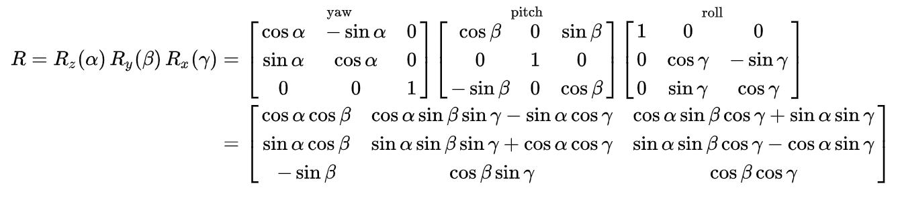
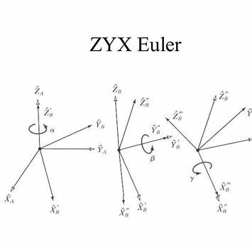
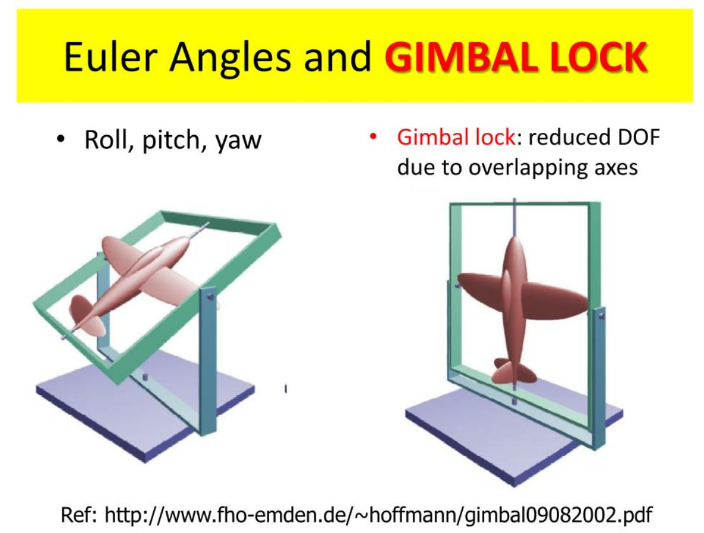
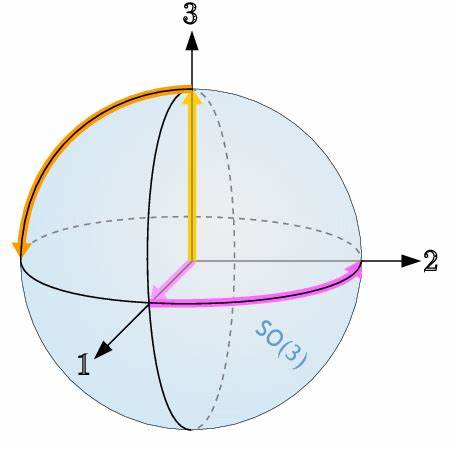

## 第二章：旋转的多种表示方法

> **课程**：国立台湾大学 林沛群教授《机器人学》
> **作者**：Travor
> **更新日期**：2026-03

---

### 前言

旋转矩阵有 9 个元素，但旋转只有 3 个自由度。这 9 个元素之间存在约束，**直接参数化、插值、或与人类直觉沟通都很麻烦**。因此，机器人学发展出了多种等价但各有侧重的旋转表示方法。

本章的核心是搞清楚：**Fixed Angles**、**Euler Angles**、以及最关键的——**左乘还是右乘，到底代表什么物理含义**。

---

### 2.1 旋转矩阵的双重角色

旋转矩阵 ${}^A_BR$ 有两种截然不同的使用方式，理解这一点至关重要：

#### 角色一：坐标系之间的关系描述（Description of Frame）

$${}^A_BR = \begin{bmatrix} {}^A\hat{x}_B & {}^A\hat{y}_B & {}^A\hat{z}_B \end{bmatrix}$$

**物理意义**：${}^A_BR$ 的列向量是坐标系 $B$ 的三个基向量**在坐标系 $A$ 中**的表示。

#### 角色二：坐标变换（Coordinate Transformation）

将同一个点从坐标系 $B$ 的描述转换到坐标系 $A$：$${}^A\mathbf{p} = {}^A_BR \cdot {}^B\mathbf{p}$$

#### 角色三：旋转算子（Rotation Operator）

对同一坐标系内的向量施加旋转：$$\mathbf{p}' = R \cdot \mathbf{p}$$

> **易混淆点**：同一个 $R$ 矩阵，用作"坐标变换"时是被动变换（坐标系转了，点没动），用作"旋转算子"时是主动变换（点动了，坐标系没动）。**这两种解读的数学形式完全相同，但物理意义相反。**

---

### 2.2 Fixed Angles（固定角）

#### 定义

**Fixed Angles** 也称为 **X-Y-Z Fixed Angles**（RPY 角，Roll-Pitch-Yaw）。

> **核心思想**：所有旋转都相对于**固定的（不动的）世界坐标系**的轴进行。

操作步骤：

1. 先绕固定坐标系的 $X$ 轴旋转 $\gamma$（Roll）
2. 再绕固定坐标系的 $Y$ 轴旋转 $\beta$（Pitch）
3. 最后绕固定坐标系的 $Z$ 轴旋转 $\alpha$（Yaw）

#### 旋转矩阵推导

$$R_{XYZ}(\gamma, \beta, \alpha) = R_Z(\alpha) R_Y(\beta) R_X(\gamma)$$

**注意书写顺序！** 矩阵**从右到左**相乘：

$$R_{XYZ} = R_Z(\alpha) \cdot R_Y(\beta) \cdot R_X(\gamma)$$

展开为：

$$R_{XYZ} = \begin{bmatrix}
c\alpha c\beta & c\alpha s\beta s\gamma - s\alpha c\gamma & c\alpha s\beta c\gamma + s\alpha s\gamma \\
s\alpha c\beta & s\alpha s\beta s\gamma + c\alpha c\gamma & s\alpha s\beta c\gamma - c\alpha s\gamma \\
-s\beta & c\beta s\gamma & c\beta c\gamma
\end{bmatrix}$$

其中 $c\theta = \cos\theta$，$s\theta = \sin\theta$。

---

### 2.3 Euler Angles（欧拉角）

#### 定义

**Euler Angles** 的每次旋转都相对于 **当前的本体坐标系（随刚体转动的坐标系）** 进行。

> **核心思想**：坐标系跟着刚体走，每次旋转的轴都是"当前姿态"下的轴。

**Z-Y-X Euler Angles** 操作步骤：
1. 先绕当前 $Z$ 轴旋转 $\alpha$
2. 再绕**新的** $Y'$ 轴旋转 $\beta$
3. 最后绕**新的** $X''$ 轴旋转 $\gamma$

#### 旋转矩阵推导

$$R_{Z'Y'X''}(\alpha, \beta, \gamma) = R_Z(\alpha) R_Y(\beta) R_X(\gamma)$$

**amazing！Z-Y-X Euler Angles 和 X-Y-Z Fixed Angles 的最终旋转矩阵完全相同**

$$R_{\text{Fixed XYZ}}(\gamma,\beta,\alpha) = R_{\text{Euler ZYX}}(\alpha,\beta,\gamma)$$

> **数学对称性**：Fixed XYZ 与 Euler ZYX 的**旋转过程路径（中间姿态）不同**，但在参数按逆序对应时，**最终旋转矩阵相同**。从累积方式看，固定轴视角常写成左乘累积，运动轴视角常写成右乘累积。

---

### 2.4 ★ 左乘 vs 右乘：概念辨析

#### 规则总结

设当前姿态为 $R$，现在要再施加一个旋转 $R_{new}$：

| 乘法方式 | 公式 | 物理含义 |
|----------|------|----------|
| **左乘** | $R' = R_{new} \cdot R$ | 新旋转是 **相对于固定坐标系（世界系）** 定义的 |
| **右乘** | $R' = R \cdot R_{new}$ | 新旋转是 **相对于当前本体坐标系** 定义的 |

#### 先说清楚 $R$ 的意义

我们先固定一种最常见、最标准的解释：
>设 $R$ 表示“**本体坐标系相对于世界坐标系的姿态**”，并且它把**本体系坐标表示**的向量，变成世界系坐标表示：
>$$v^w = R\,v^b$$

这里：
- $v^b$：同一个几何向量，在本体系下的坐标
- $v^w$：同一个几何向量，在世界系下的坐标
- $R$：把“本体坐标表示”转换成“世界坐标表示”的旋转矩阵，即 ${}^w_bR$

#### 从公式推导：为什么左乘是绕世界轴，右乘是绕本体系轴

##### 1. 左乘：绕世界坐标系的轴旋转
假设当前姿态满足：$$v^w = R\,v^b$$现在我们想让整个物体再绕**世界系的某个固定轴**转一个旋转 $R_{\text{new}}$。
“绕世界轴转”意味着：
这个新增旋转直接作用在世界坐标表示上，也就是作用在 $v^w$ 上：$$v'^w = R_{\text{new}}\,v^w$$把原式代入：$$v'^w = R_{\text{new}}(R\,v^b) = (R_{\text{new}}R)\,v^b$$因此新的姿态矩阵就是：$$R' = R_{\text{new}}R$$这就是*左乘*

##### 2. 右乘：绕本体坐标系的轴旋转
依旧$$v^w = R\,v^b$$现在我们想让物体绕**它自己当前的轴**转一个旋转 $R_{\text{new}}$。
“绕本体系轴转”意味着：
这个新增旋转是定义在**本体系坐标**里的，也就是改变的是 $v^b$ 这一侧。
所以$$v'^w = R\,(R_{\text{new}}v^b) = (R\,R_{\text{new}})v^b$$更准确地说，物体转完后，同一个几何向量在“旧本体系”和“新本体系”中的坐标关系会发生变化。推导后得到新的姿态更新为：
$$R' = R\,R_{\text{new}}$$这就是*右乘*

#### 真正的核心：左乘右乘不是“数学技巧”，而是“旋转轴定义在哪个坐标系里”
实际上回答的是：
>这个“新增旋转”是用哪个坐标系的轴来定义的？

---

### 2.5 Mapping（映射）与坐标变换

#### 向量在不同坐标系间的映射

已知向量 ${}^B\mathbf{p}$ 在坐标系 $B$ 中的描述，求在坐标系 $A$ 中的描述：

$${}^A\mathbf{p} = {}^A_BR \cdot {}^B\mathbf{p}$$

这里 ${}^A_BR$ 是从 $B$ 到 $A$ 的旋转矩阵（其列是 $B$ 的基向量在 $A$ 中的坐标）。

#### 链式映射

$${}^A\mathbf{p} = {}^A_BR \cdot {}^B_CR \cdot {}^C\mathbf{p}$$

注意：矩阵相乘的上下标遵循**消去规则**：${}^A_BR \cdot {}^B_CR = {}^A_CR$，中间的 $B$ 消去。

> 类似分数乘法：$\frac{A}{B} \times \frac{B}{C} = \frac{A}{C}$

---

### 2.6 齐次变换矩阵（Homogeneous Transformation Matrix）

#### 动机

旋转矩阵只能描述旋转，无法描述平移。为了统一表示**旋转 + 平移**，引入齐次坐标和齐次变换矩阵。

#### 定义

$${}^A_BT = \begin{bmatrix} {}^A_BR & {}^A\mathbf{p}_{B_{org}} \\ \mathbf{0}^T & 1 \end{bmatrix} = \begin{bmatrix} r_{11} & r_{12} & r_{13} & p_x \\ r_{21} & r_{22} & r_{23} & p_y \\ r_{31} & r_{32} & r_{33} & p_z \\ 0 & 0 & 0 & 1 \end{bmatrix}$$

其中：
- 左上角 $3\times3$：旋转部分 ${}^A_BR$
- 右上角 $3\times1$：平移部分（坐标系 $B$ 的原点在 $A$ 中的位置）
- 底部一行：$[0\ 0\ 0\ 1]$，保持齐次结构

#### 齐次坐标

点 $P$ 的齐次坐标：
$${}^B\tilde{\mathbf{p}} = \begin{bmatrix} {}^B\mathbf{p} \\ 1 \end{bmatrix} = \begin{bmatrix} p_x \\ p_y \\ p_z \\ 1 \end{bmatrix}$$

向量（自由向量）的齐次坐标：
$${}^B\tilde{\mathbf{v}} = \begin{bmatrix} {}^B\mathbf{v} \\ 0 \end{bmatrix}$$

最后一位是 $0$ 还是 $1$，区分了**向量**和**点**——向量的最后一位为 0，平移不影响向量（因为 $T$ 中的 $\mathbf{p}$ 乘以 $0$ 为零）。

#### 变换应用

$${}^A\tilde{\mathbf{p}} = {}^A_BT \cdot {}^B\tilde{\mathbf{p}}$$

展开验证：

$$\begin{bmatrix}{}^A\mathbf{p}\\1\end{bmatrix} = \begin{bmatrix}{}^A_BR & {}^A\mathbf{d}\\0^T & 1\end{bmatrix}\begin{bmatrix}{}^B\mathbf{p}\\1\end{bmatrix} = \begin{bmatrix}{}^A_BR \cdot {}^B\mathbf{p} + {}^A\mathbf{d}\\1\end{bmatrix}$$

完美！旋转和平移合在一次矩阵乘法中完成。

#### 逆变换

$${}^A_BT^{-1} = {}^B_AT = \begin{bmatrix} {}^A_BR^T & -{}^A_BR^T \cdot {}^A\mathbf{d} \\ \mathbf{0}^T & 1 \end{bmatrix}$$

> 不要直接对 $T$ 求逆（代价高），利用旋转矩阵的正交性可以高效计算。

#### 链式变换

$${}^A_CT = {}^A_BT \cdot {}^B_CT$$

左乘/右乘的规则与旋转矩阵完全相同：
- **左乘** $T_{new}$：相对固定坐标系进行变换
- **右乘** $T_{new}$：相对当前本体坐标系进行变换

---

## 2.7 Euler Angles 的奇异性（Gimbal Lock）

欧拉角在某些姿态下会出现**万向锁（Gimbal Lock）**——当中间轴旋转 $\pm 90°$ 时，第一轴和第三轴对齐，丢失一个自由度。

**数学表现**：以 Z-Y-X 欧拉角为例，当 $\beta = 90°$ 时：

$$R = R_Z(\alpha)R_Y(90°)R_X(\gamma) = \begin{bmatrix}0 & \sin(\gamma-\alpha) & \cos(\gamma-\alpha) \\ 0 & \cos(\gamma-\alpha) & -\sin(\gamma-\alpha) \\ -1 & 0 & 0\end{bmatrix}$$

此时只有 $(\gamma - \alpha)$ 是独立的，$\alpha$ 和 $\gamma$ 单独无法区分，表示退化了。

**工程意义**：航空中的 Gimbal Lock 问题是促使人们发展**四元数（Quaternion）**表示的重要动因，四元数没有这一奇异性问题（后续章节会讲）。

---

### 总结与反思

#### 要点

| 概念 | 关键记忆点 |
|------|-----------|
| Fixed Angles | 绕**不动**的世界系轴，左乘累积 |
| Euler Angles | 绕**运动**的本体系轴，右乘累积 |
| 左右互换关系 | X-Y-Z Fixed = Z-Y-X Euler（参数顺序反转）|
| 左乘 | 绕世界轴旋转 |
| 右乘 | 绕本体轴旋转 |
| 齐次变换矩阵 | 旋转 + 平移合并，$4\times4$ 矩阵 |
| 点 vs 向量 | 齐次坐标最后一位：点为 1，向量为 0 |

> "Fixed Angles 是在外面看刚体旋转，Euler Angles 是坐在刚体上感受旋转。"

这两种视角都是合法的，只是习惯问题。工程师常用 RPY（Fixed X-Y-Z）和 ZYX Euler 交替使用，但只要知道参数对应关系（互为逆序），可以自由切换。

**最重要的工程习惯**：在写代码或设计接口时，必须明确指定用的是哪种约定，否则极容易出 bug。ROS 里用的是 RPY，很多 IMU 也输出 RPY，但有些库默认 ZYX Euler——混用是灾难。

#### 延伸

**1. 为什么 $SO(3)$ 不能用 3 个参数全局无奇异地参数化？**

虽然三维旋转只有 3 个自由度，但这只说明 **$SO(3)$** 是一个 **3 维流形**，即在每个姿态附近都能用 3 个局部参数描述；它并不意味着存在一套像 $\mathbb{R}^3$ 那样的全局欧氏坐标，可以无缝覆盖所有旋转。

其根本原因是：  
**$SO(3)$** 的全局拓扑并不是 $\mathbb{R}^3$。[Cambridge 讲义](https://www.damtp.cam.ac.uk/user/examples/3P2.pdf)指出，任意旋转都可由"旋转轴" $\hat{n}$ 与"旋转角" $\psi\in[0,\pi]$ 确定，并表示为向量 $\psi\hat{n}$。因此，$SO(3)$ 可视为一个半径为 $\pi$ 的三维实心球；但在球面上，绕 $\hat{n}$ 旋转 $\pi$ 与绕 $-\hat{n}$ 旋转 $\pi$ 是同一旋转，所以边界上的对径点必须识别为同一点。于是

$$SO(3)=\{\text{半径 }\pi\text{ 的球体，边界对径点识别}\}$$

这与普通的 $\mathbb{R}^3$ 明显不是同一种空间。等价地，

$$SO(3)\cong S^3/\{\pm1\}\cong \mathbb{RP}^3$$

这说明 $SO(3)$ 具有非平凡的全局拓扑结构。

因此，任何只用 3 个参数的姿态表示（如欧拉角、RPY 角等）都只能是 $SO(3)$ 上的局部坐标图，而不可能是覆盖整个 $SO(3)$ 的全局无奇异坐标。欧拉角中的奇异现象与球面经纬度在极点退化完全类似：在某些特殊姿态下，参数失去独立性，坐标映射的雅可比退化，从而出现所谓的 Gimbal Lock。[Modern Robotics](https://modernrobotics.northwestern.edu/nu-gm-book-resource/2-3-2-configuration-space-representation/) 用球面北极处"经度失效"的例子说明了最小坐标表示在非欧空间上的这种必然退化。[Berkeley](https://rotations.berkeley.edu/the-euler-angle-parameterization/) 的讲解则指出，Euler angles 的奇异性对这类三参数表示是不可避免的。

Hairy Ball 定理可以作为一种直观类比：它说明在具有非平凡拓扑的球面上，不可能做出处处连续且无退化的全局选择。但对 $SO(3)$ 而言，更直接的数学原因仍然是其拓扑同于 $\mathbb{RP}^3$，而不是 $\mathbb{R}^3$。
>Hairy Ball 定理可以作为帮助理解“全局无缝选择不可能”的直观类比，但它不是这里最直接的数学证明。

**2. 四元数如何避免 Gimbal Lock？**

单位四元数用 4 个参数 $(q_w,q_x,q_y,q_z)$ 加 1 个约束 $\|q\|=1$ 表示旋转，本质上是在 $S^3$ 上表示姿态，再通过双覆盖映射到 $SO(3)$。  
它避免 Gimbal Lock 的关键不在于"多一个参数"，而在于**不再使用逐轴旋转分解**：

- 欧拉角奇异：来自"先绕哪根轴、再绕哪根轴"的序列在某些姿态（如中间角 $\pm90^\circ$）发生轴重合
- 四元数无此分解：旋转作为一个整体元素表示与插值，不会在姿态空间内部出现这种轴重合奇异

工程上这带来两个直接好处：

- 姿态积分与插值更稳定（常用 SLERP）
- 数值优化中避免欧拉角在奇异点附近的剧烈跳变

但要注意：若最终把四元数再转回欧拉角显示，欧拉角奇异仍会在显示层出现；被避免的是**内部表示奇异**，不是"世界上没有奇异"。

**3. 什么时候应该用旋转矩阵，什么时候用欧拉角？**

一个实用原则：**内部计算用旋转矩阵（或四元数），人机接口用欧拉角**。

| 场景 | 更推荐 | 原因 |
| --- | --- | --- |
| 连续坐标变换、链式位姿计算 | 旋转矩阵 | 直接做乘法，和齐次变换 $T$ 无缝拼接 |
| 机器人运动学/动力学推导 | 旋转矩阵 | 线性代数形式统一，便于证明正交性与求逆 |
| 日志展示、参数调试、UI 输入 | 欧拉角 | 人更容易理解"roll/pitch/yaw" |
| 接口协议/跨系统传参 | 视协议而定 | 若用欧拉角必须同时写明顺序与参考系（如 ZYX、intrinsic/extrinsic） |

最常见工程实践是：

- 算法内部维护 $R$（或 quaternion）
- 仅在输入输出层做欧拉角转换
- 每个接口强制写清约定（轴顺序、左乘/右乘、主动/被动）

这样既保留计算稳定性，也保留可读性，能最大程度避免姿态相关 bug。

---

### 可视化

参见 [`Chapter02_visualization.ipynb`](Chapter02_visualization.ipynb)

可视化内容：
- Fixed Angles vs Euler Angles 的动态对比
- 左乘右乘的不同旋转效果
- Gimbal Lock 的可视化演示
- 齐次变换矩阵的 3D 坐标系变换动画
