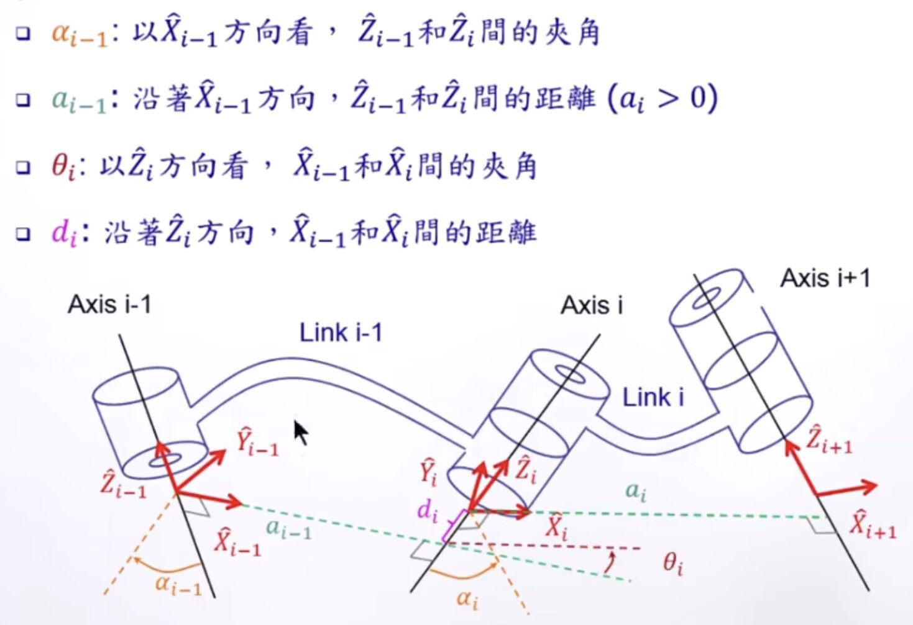
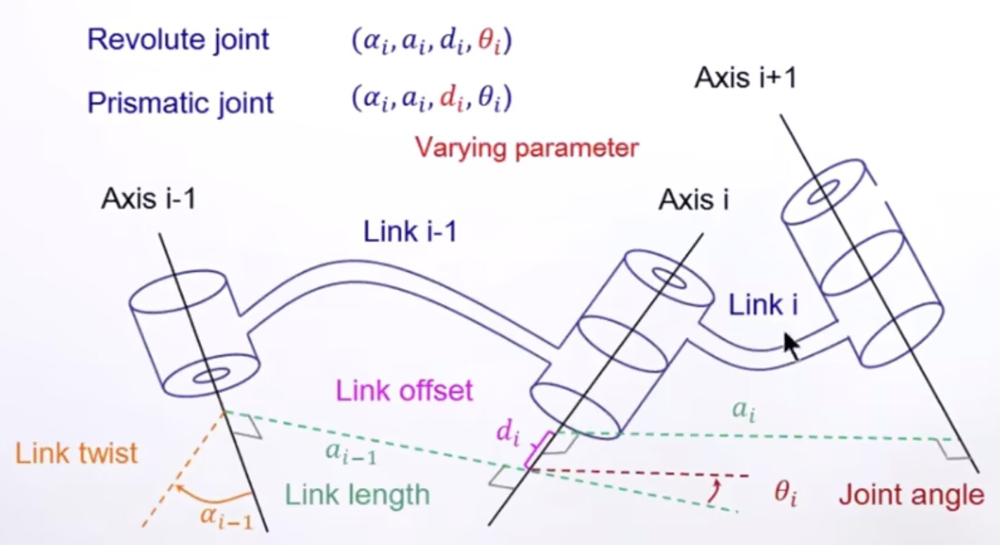
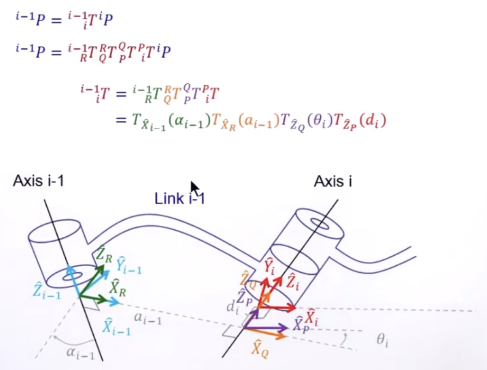
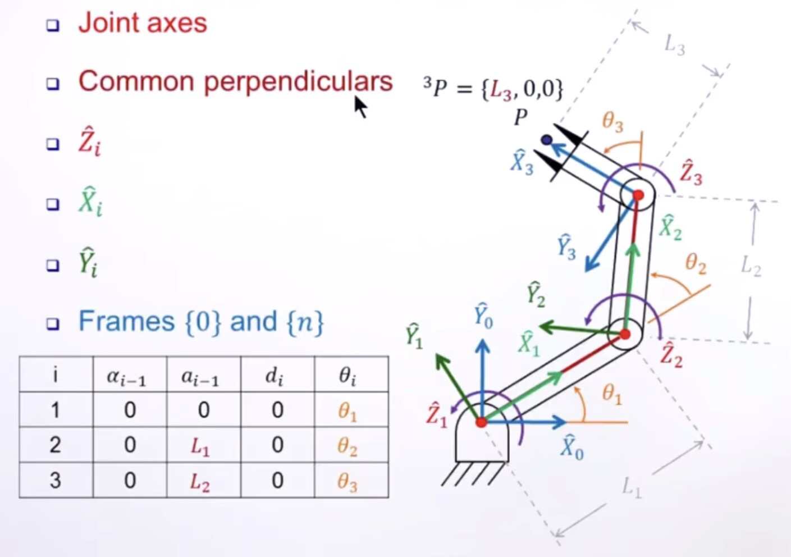

## 第三章：机械手臂顺运动学

> **课程**：国立台湾大学 林沛群教授《机器人学》
> **作者**：Travor
> **更新日期**：2026-03

---

### 前言

前两章解决的是一个刚体怎么描述自己的位置与姿态；从这一章开始，问题升级成：

> **一串连杆和关节组成的机械手臂，给定每个关节变量后，末端执行器到底会到哪里？**

这就是 **顺运动学（Forward Kinematics, FK）**。
输入是关节变量，输出是末端位姿。真正的难点在于：机械手臂是**多个刚体通过关节串接形成的链式系统**，不能把它当成一个整体刚体来处理。

核心思路：

1. 给每节连杆附近定义一个局部坐标系
2. 把相邻连杆之间的相对变换写成矩阵
3. 用齐次变换一路相乘，得到末端执行器在基座坐标系中的位姿

---

### 3.1 机械手臂的几何组成

一条串联机械手臂（serial manipulator）由以下元素组成：

- **Link（杆件）**：刚性部分（link 0 是地杆，固定不动）
- **Joint（关节）**：允许相邻连杆发生相对运动
- **Base Frame**：安装在机械手臂底座上的参考坐标系
- **End-Effector / Tool Frame**：安装在末端执行器上的坐标系

对应关系：

- **需求**：手臂末端点状态（位置 ${}^W\mathbf{p}$、速度）
- **达成方式**：驱动各制动器，使

$${}^W\mathbf{p} = f(\theta_1, \theta_2, \ldots, \theta_n)$$

最常见的关节有两类：

| 关节类型 | 变量 | 描述 |
| ------- | ---- | ---- |
| **Revolute Joint（转动关节）** | $\theta_i$（角度） | 绕某轴旋转 |
| **Prismatic Joint（移动关节）** | $d_i$（位移） | 沿某轴平移 |

> 每个 revolute 或 prismatic joint 具有 **1 DOF**，针对某特定轴做旋转或平移。

若机械手臂有 $n$ 个关节，关节变量写成配置向量

$$\mathbf{q} = \begin{bmatrix} q_1 & q_2 & \cdots & q_n \end{bmatrix}^T$$

> 顺运动学的本质：求解从 $\mathbf{q}$ 到末端位姿 $T(\mathbf{q})$ 的映射。

---

### 3.2 相邻连杆之间的位姿关系

由第二章可知，单个刚体之间的相对位姿用齐次变换表示：

$$
{}^{i-1}_iT =
\begin{bmatrix}
{}^{i-1}_iR & {}^{i-1}\mathbf{p}_i \\
\mathbf{0}^T & 1
\end{bmatrix}
$$

串联机械臂的整体变换就是各段相乘：

$$
{}^0_nT = {}^0_1T \cdot {}^1_2T \cdot {}^2_3T \cdots {}^{n-1}_nT
$$

第三章的真正关键不在于乘法本身，而在于：

> **如何稳定、统一、不容易写错地定义每节连杆的局部坐标系。**

这就是 DH 表达法要解决的问题。

---

### 3.3 DH 表达法（Denavit-Hartenberg Convention）

#### 动机

如果每节连杆都随意定义自己的坐标系，每一段变换都要重新推一次，公式会非常乱。
DH 表达法规定一套**统一的坐标系摆放规则**，让相邻两节之间的变换矩阵可以写成固定模板。

#### 坐标系摆放规则

林教授课程采用 **Craig 改进型 DH（Modified DH）约定**，坐标系定义规则如下：

- $\hat{Z}_i$：指向第 $i$ 个关节轴的方向
- $\hat{X}_i$：指向 $\hat{Z}_i$ 到 $\hat{Z}_{i+1}$ 之间公垂线（common normal）的方向
- $\hat{Y}_i$：由右手定则确定

#### 四个参数的几何意义

Modified DH 用四个参数描述从坐标系 $\{i-1\}$ 到 $\{i\}$ 的变换。**注意下标规律**：$\alpha$ 和 $a$ 描述杆件 $i-1$ 的几何，$\theta$ 和 $d$ 描述关节 $i$ 的状态。

| 参数 | 名称 | 几何定义 |
| ---- | ---- | ------- |
| $\alpha_{i-1}$ | **Link Twist（连杆扭角）** | 以 $\hat{X}_{i-1}$ 方向看，$\hat{Z}_{i-1}$ 和 $\hat{Z}_i$ 之间的夹角：$\alpha_{i-1} = \angle(\hat{Z}_{i-1} \to \hat{Z}_i)\ \text{about}\ \hat{X}_{i-1}$，符号由 $\operatorname{sgn}(\alpha_{i-1}) = (\hat{Z}_{i-1} \times \hat{Z}_i) \cdot \hat{X}_{i-1}$ 确定 |
| $a_{i-1}$ | **Link Length（连杆长度）** | 沿 $\hat{X}_{i-1}$ 方向，$\hat{Z}_{i-1}$ 和 $\hat{Z}_i$ 之间的距离（$a_{i-1} \geq 0$） |
| $\theta_i$ | **Joint Angle（关节角）** | 以 $\hat{Z}_i$ 方向看，$\hat{X}_{i-1}$ 和 $\hat{X}_i$ 之间的夹角 |
| $d_i$ | **Link Offset（连杆偏移）** | 沿 $\hat{Z}_i$ 方向，$\hat{X}_{i-1}$ 和 $\hat{X}_i$ 之间的距离 |

变量与关节类型的对应：

- **转动关节（Revolute）**：$\theta_i$ 是变量，$\alpha_{i-1},\, a_{i-1},\, d_i$ 是常数
- **移动关节（Prismatic）**：$d_i$ 是变量，$\alpha_{i-1},\, a_{i-1},\, \theta_i$ 是常数

#### Modified DH 单段变换

按照 Modified DH 约定，从 $\{i-1\}$ 到 $\{i\}$ 的变换分四步：

$$
{}^{i-1}_iT = R_x(\alpha_{i-1})\, T_x(a_{i-1})\, R_z(\theta_i)\, T_z(d_i)
$$

理解为「先把旧连杆方向对上，再做关节旋转/平移」：

1. 绕旧的 $x$ 轴转 $\alpha_{i-1}$（把 $z_{i-1}$ 转到和 $z_i$ 平行）
2. 沿旧的 $x$ 轴平移 $a_{i-1}$（沿公垂线移到 $z_i$ 所在位置）
3. 绕新的 $z$ 轴转 $\theta_i$（关节旋转，对齐 $x$ 轴）
4. 沿新的 $z$ 轴平移 $d_i$（关节平移，移到坐标系原点）

展开为矩阵：

$$
{}^{i-1}_iT =
\begin{bmatrix}
c\theta_i & -s\theta_i & 0 & a_{i-1} \\
s\theta_i c\alpha_{i-1} & c\theta_i c\alpha_{i-1} & -s\alpha_{i-1} & -d_i s\alpha_{i-1} \\
s\theta_i s\alpha_{i-1} & c\theta_i s\alpha_{i-1} &  c\alpha_{i-1} &  d_i c\alpha_{i-1} \\
0 & 0 & 0 & 1
\end{bmatrix}
$$

> **x 轴负责连杆几何（$\alpha, a$），z 轴负责关节运动（$\theta, d$）。**
> 这是 DH 表达法最该记住的一句话。

---

### 3.4 3R 平面机械手臂的顺运动学

以课程中的 **3R 平面机械臂**（RRR Manipulator）为例，三杆长度分别为 $L_1, L_2, L_3$，关节角为 $\theta_1, \theta_2, \theta_3$。

#### 几何法（直接写出坐标）

从基座逐节累加：每节杆末端相对上一节末端，偏转了所有之前关节角的累积。

$$
x = L_1\cos\theta_1 + L_2\cos(\theta_1+\theta_2) + L_3\cos(\theta_1+\theta_2+\theta_3)
$$

$$
y = L_1\sin\theta_1 + L_2\sin(\theta_1+\theta_2) + L_3\sin(\theta_1+\theta_2+\theta_3)
$$

末端姿态角：

$$
\phi = \theta_1 + \theta_2 + \theta_3
$$

#### 矩阵法（齐次变换连乘）

末端工具点在坐标系 $\{3\}$ 中的位置为 ${}^3P = \{L_3, 0, 0\}$。

**DH 参数表**（所有关节轴平行，故 $\alpha = 0$；平面机构 $d = 0$）：

| $i$ | $\alpha_{i-1}$ | $a_{i-1}$ | $d_i$ | $\theta_i$ |
| --- | ------------- | --------- | ----- | --------- |
| 1 | 0 | 0 | 0 | $\theta_1$ |
| 2 | 0 | $L_1$ | 0 | $\theta_2$ |
| 3 | 0 | $L_2$ | 0 | $\theta_3$ |

当 $\alpha_{i-1} = 0,\, d_i = 0$ 时，单段变换矩阵化简为：

$$
{}^{i-1}_iT =
\begin{bmatrix}
c\theta_i & -s\theta_i & 0 & a_{i-1} \\
s\theta_i &  c\theta_i & 0 & 0 \\
0 & 0 & 1 & 0 \\
0 & 0 & 0 & 1
\end{bmatrix}
$$

三段变换矩阵：

$$
{}^0_1T =
\begin{bmatrix}
c_1 & -s_1 & 0 & 0 \\
s_1 &  c_1 & 0 & 0 \\
0   &  0   & 1 & 0 \\
0   &  0   & 0 & 1
\end{bmatrix}
\quad
{}^1_2T =
\begin{bmatrix}
c_2 & -s_2 & 0 & L_1 \\
s_2 &  c_2 & 0 & 0   \\
0   &  0   & 1 & 0   \\
0   &  0   & 0 & 1
\end{bmatrix}
\quad
{}^2_3T =
\begin{bmatrix}
c_3 & -s_3 & 0 & L_2 \\
s_3 &  c_3 & 0 & 0   \\
0   &  0   & 1 & 0   \\
0   &  0   & 0 & 1
\end{bmatrix}
$$

其中 $c_i = \cos\theta_i,\; s_i = \sin\theta_i$。

**连乘结果** ${}^0_3T = {}^0_1T \cdot {}^1_2T \cdot {}^2_3T$：

$$
{}^0_3T =
\begin{bmatrix}
c_{123} & -s_{123} & 0 & L_1 c_1 + L_2 c_{12} \\
s_{123} &  c_{123} & 0 & L_1 s_1 + L_2 s_{12} \\
0       &  0       & 1 & 0 \\
0       &  0       & 0 & 1
\end{bmatrix}
$$

其中 $c_{12} = \cos(\theta_1+\theta_2),\; c_{123} = \cos(\theta_1+\theta_2+\theta_3)$，$s$ 同理。

**末端工具点**：将 ${}^3P = [L_3,\, 0,\, 0,\, 1]^T$ 代入 ${}^0P = {}^0_3T \cdot {}^3P$：

$$\begin{bmatrix} x \\ y \end{bmatrix}=
\begin{bmatrix}
L_1 c_1 + L_2 c_{12} + L_3 c_{123} \\
L_1 s_1 + L_2 s_{12} + L_3 s_{123}
\end{bmatrix}
$$

末端姿态角：$\phi = \theta_1 + \theta_2 + \theta_3$

> 每多一节连杆，末端位置就多一项 $L_k\cos(\theta_1+\cdots+\theta_k)$——这正是齐次矩阵连乘的几何意义。
> 「几何法」和「矩阵法」是同一件事的两种写法，结果完全一致。

---

### 3.5 从单段变换到整条机械臂

对 $n$ 自由度串联机械臂：

$$
{}^0_nT(\mathbf{q}) = \prod_{i=1}^{n} {}^{i-1}_iT(q_i)
$$

结果包含两类信息：

$$
{}^0_nT =
\begin{bmatrix}
R_{3\times3} & \mathbf{p}_{3\times1} \\
\mathbf{0}^T & 1
\end{bmatrix}
$$

- 左上角 $3\times3$：末端姿态 $R$
- 右上角 $3\times1$：末端位置 $\mathbf{p}$

这也是机器人软件里最常见的输出形式：**给一组关节角，返回一个 `pose` / `transform`。**

---

### 3.6 Actuator Space、Joint Space、Cartesian Space

林教授特别强调，机器人学里常混着三个不同层次的变量：

#### Actuator Space（执行器空间）

马达、编码器、减速器那一层的变量，例如电机转角、编码器脉冲数。
比如有齿轮减速时，电机转一圈，关节不一定转一圈——两者不能混淆。

#### Joint Space（关节空间）

机器人建模最常用的空间：

$$\mathbf{q} = [q_1, q_2, \dots, q_n]^T$$

每个关节变量直接对应机构自由度。

#### Cartesian Space（笛卡尔空间）

末端执行器在任务空间中的状态：

$$\mathbf{x} = [x, y, z, \phi, \theta, \psi]^T$$

也可写成位姿矩阵 $T$。

---

### 3.7 三种空间之间的关系

机械臂建模和控制的核心链路：

$$
\text{执行器空间} \xrightarrow{\text{传动机构}} \text{关节空间} \xrightarrow{\text{顺运动学}} \text{笛卡尔空间}
$$

工程上最常见的一条路：

$$
\text{编码器读数} \rightarrow \mathbf{q} \rightarrow T(\mathbf{q})
$$

这就是为什么顺运动学几乎是所有机械臂软件栈的基础模块——控制、可视化、碰撞检测、抓取规划，都要先能稳定地算 FK。

---

### 总结与反思

#### 要点

| 概念 | 关键记忆点 |
| --- | --- |
| 顺运动学 | 输入关节变量，输出末端位姿 |
| Modified DH | 参数 $(\alpha_{i-1}, a_{i-1}, d_i, \theta_i)$，x 轴管连杆，z 轴管关节 |
| 单段变换顺序 | $R_x(\alpha_{i-1})\, T_x(a_{i-1})\, R_z(\theta_i)\, T_z(d_i)$ |
| 齐次连乘 | 整条机械臂位姿 = 各段变换矩阵连乘 |
| Joint Space | 机械臂各自由度的自然参数空间 |
| Cartesian Space | 末端执行器的任务空间 |

> 前两章讲「一个刚体怎么表达自己」；
> 第三章讲「多个刚体怎么接成一条会动的链」。

#### 延伸

**1. Modified DH 和 Standard DH 有何区别？**

Standard DH（原始 DH）的参数下标全为 $i$，变换顺序是 $R_z(\theta_i)\,T_z(d_i)\,T_x(a_i)\,R_x(\alpha_i)$，先对上关节轴，再对上连杆轴。
Modified DH（Craig 约定，林教授课程所用）参数下标 $a, \alpha$ 归到 $i-1$，变换顺序调换为先对连杆再对关节，使 DH 参数表的行与连杆一一对应，物理意义更直观。
两种约定写出来的矩阵形式不同，**使用别人 DH 参数表时务必先确认是哪种约定。**

**2. DH 表达法有没有局限？**

有。坐标系放置规则比较敏感，容易在轴方向、原点位置、$\alpha$ 和 $\theta$ 的正负号上出错。
复杂机构或并联机构里，DH 也不一定是最自然的表示。现代机器人学里，**POE（Product of Exponentials，指数积）** 表达法也很常见，规避了 DH 的奇异性问题。

---

### 可视化

参见 [`Chapter03_visualization.ipynb`](Chapter03_visualization.ipynb)

可视化内容：

- DH 四参数对局部坐标系的影响
- 2R 平面机械臂的顺运动学
- 3R 机械臂的关节空间与末端轨迹关系
- 工作空间与末端路径的直观展示
