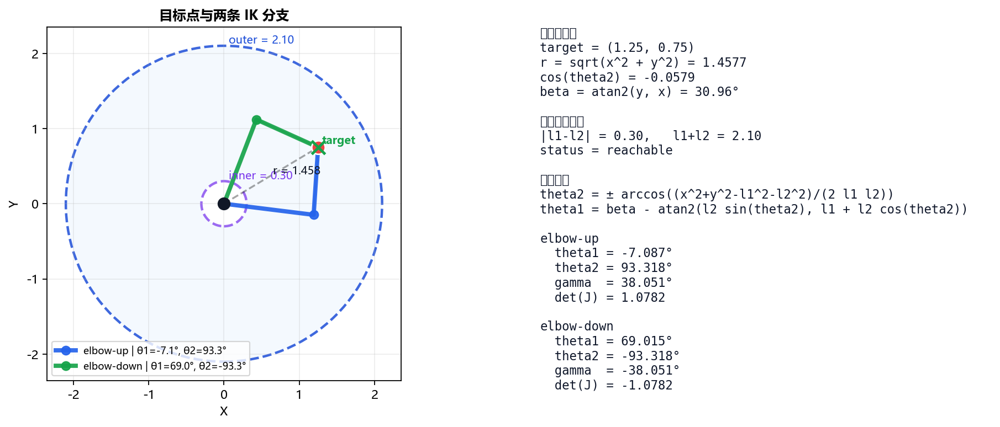
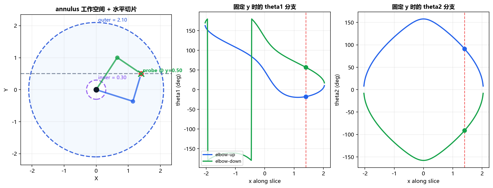
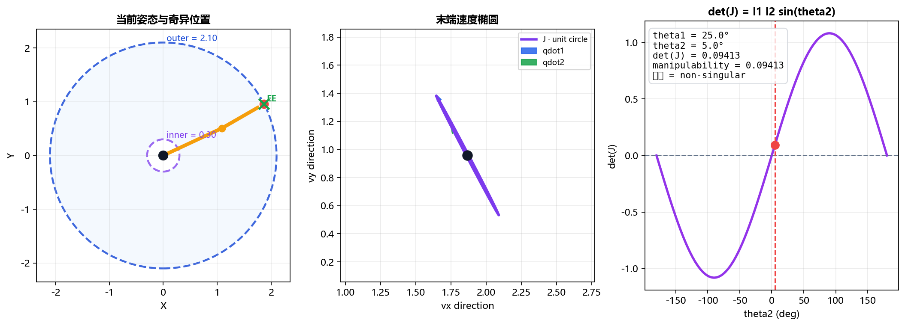
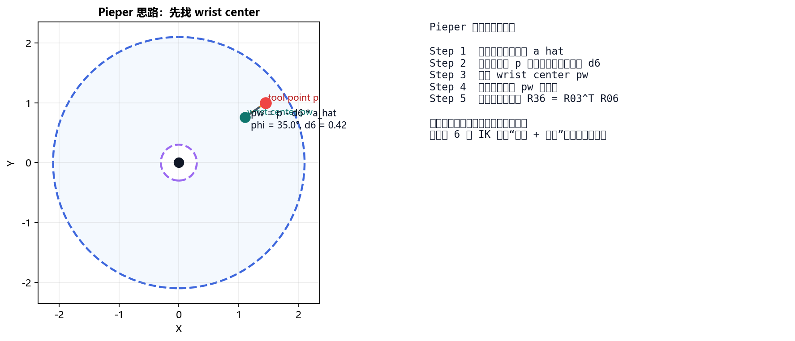
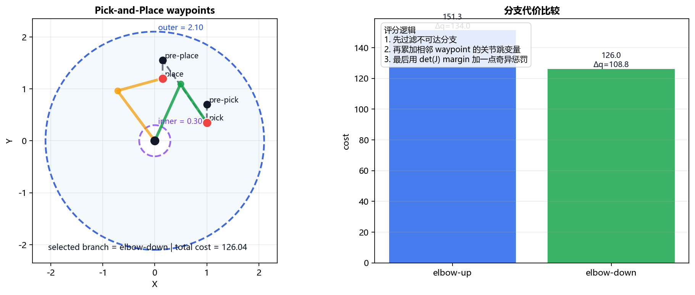

## 第四章：机械手臂逆运动学

> **课程**：国立台湾大学 林沛群教授《机器人学》  
> **作者**：Travor  
> **更新日期**：2026-04

---

### 前言

第三章的顺运动学是：

> 给定关节变量 $\mathbf{q}$，求末端位姿 $T(\mathbf{q})$

那第四章自然就会问：

> 如果末端希望到达某个位置与姿态，应该让每个关节转到多少？

这就是 **逆运动学（Inverse Kinematics, IK）**。

从数学形式看，它像是在求

$$
\mathbf{q} = f^{-1}(\mathbf{x})
$$

但从工程意义看，IK 往往不是“求一个反函数”，而是在求一个**候选解集合**。  
因为同一个末端位姿，可能有多组关节解；也可能根本无解；即使有解，也可能刚好落在奇异点附近，不适合实际控制。

所以第四章真正想建立的，不只是“会反解公式”，而是下面这几个判断：

- 目标点是否可达
- 若可达，有几条几何分支
- 哪些分支比较连续、稳定、远离奇异点
- 对 6-DoF 机构，能否利用结构条件把问题拆开来解

---

### 4.1 逆运动学的本质：从唯一值到解空间

设机械手臂的顺运动学为

$$
\mathbf{x} = f(\mathbf{q})
$$

其中：

- $\mathbf{q}$：关节空间变量（joint space）
- $\mathbf{x}$：末端在任务空间 / 笛卡尔空间中的状态（task space / Cartesian space）

逆运动学希望根据期望末端状态 $\mathbf{x}$，反推出关节变量：

$$
\mathbf{q} = f^{-1}(\mathbf{x})
$$

但这里要立刻警惕一件事：

> $f^{-1}$ 往往不是严格意义上的单值函数，而更像一个“解集”。

这会直接带来三种典型现象：

#### 1. 多解（multiple solutions）

同一个末端位姿，可能对应多组关节配置。

#### 2. 无解（no solution）

目标点落在工作空间外，机构根本到不了。

#### 3. 奇异（singularity）

虽然目标点表面上可达，但局部运动能力发生退化，某些方向上的微调会变得很差甚至失效。

因此，IK 的真正难点不在“把方向反过来”，而在于：

> **你不仅要算出解，还要判断这些解是不是可用、稳定、连续。**

---

### 4.2 2R 平面机械手臂的解析逆解

仍以最经典的二维两连杆机械臂为例。设目标点为 $(x,y)$，连杆长度分别为 $l_1,l_2$。

顺运动学公式是：

$$
x = l_1\cos\theta_1 + l_2\cos(\theta_1+\theta_2)
$$

$$
y = l_1\sin\theta_1 + l_2\sin(\theta_1+\theta_2)
$$

现在反过来求 $\theta_1,\theta_2$。

#### 先求 $\theta_2$

由余弦定理可得

$$
r^2 = x^2 + y^2
$$

$$
\cos\theta_2 = \frac{r^2 - l_1^2 - l_2^2}{2l_1l_2}
$$

于是

$$
\theta_2 = \pm \arccos\left(\frac{x^2+y^2-l_1^2-l_2^2}{2l_1l_2}\right)
$$

这里的正负号，就是最早应该建立的 IK 直觉：

- **elbow-up**
- **elbow-down**

它们并不是“数值上的两个答案”而已，而是**几何上两条不同的构型分支**。

#### 再求 $\theta_1$

设

$$
\beta = \operatorname{atan2}(y,x)
$$

$$
\gamma = \operatorname{atan2}(l_2\sin\theta_2,\ l_1+l_2\cos\theta_2)
$$

则

$$
\theta_1 = \beta - \gamma
$$

当 $\theta_2$ 的符号改变时，$\gamma$ 的符号也跟着改变，于是 $\theta_1$ 会一起切换到另一条分支。

> 2R 的解析 IK 之所以重要，不只是因为它简单，  
> 更因为它把“多解”这件事第一次明确地写到了公式里。



---

### 4.3 可达性、annulus 工作空间与分支连续性

#### 可达条件

2R 平面手臂的可达条件为：

$$
|l_1-l_2| \le \sqrt{x^2+y^2} \le l_1 + l_2
$$

因此它的工作空间不是整个平面，而是一个**圆环区域（annulus）**。

这条不等式其实对应两种无解方式：

- **太远**：$r > l_1+l_2$
- **太近**：$r < |l_1-l_2|$

前者表示机械臂伸到极限也够不到；后者表示即使两节杆尽量折起来，也没法缩得那么短。

#### 边界情形

当目标点位于工作空间边界时：

- 完全伸直：$\theta_2 = 0$
- 完全折叠：$\theta_2 = \pi$

此时原本的两条 IK 分支会合并成一条，意味着机构正靠近奇异状态。

#### 分支连续性

课程里很容易把“elbow-up / elbow-down”理解成两个孤立答案，但更准确的理解是：

> **它们是在工作空间上延展的两张连续解曲面。**

如果把目标点限制在一条固定的水平切片上，例如固定 $y$，只让 $x$ 改变，那么：

- `theta1(x)` 会形成两条分支曲线
- `theta2(x)` 也会形成两条分支曲线

这时就会很直观看到：

- 在可达区间内，两条分支都存在
- 接近边界时，两条曲线逐渐并拢
- 超出可达区间后，分支直接消失

这也是为什么工程上常说 IK 不只是“求角度”，而是要考虑**branch tracking**。  
只要任务路径是连续的，我们通常也希望解在同一条连续分支上滑动，而不是无缘无故跳到另一条支路。



---

### 4.4 奇异点的几何直觉：`det(J)` 与速度椭圆

奇异点（singularity）不是“程序报错”，而是：

> 在某些姿态下，关节的独立控制能力映射到任务空间后发生退化。

对 2R 机械臂，雅可比矩阵为

$$
J(\theta_1,\theta_2)=
\begin{bmatrix}
-l_1\sin\theta_1-l_2\sin(\theta_1+\theta_2) & -l_2\sin(\theta_1+\theta_2) \\
l_1\cos\theta_1+l_2\cos(\theta_1+\theta_2) & \phantom{-}l_2\cos(\theta_1+\theta_2)
\end{bmatrix}
$$

其行列式为

$$
\det(J)=l_1 l_2 \sin\theta_2
$$

因此当

$$
\theta_2=0 \quad \text{或} \quad \pi
$$

时，机构奇异。

#### 为什么说“退化”？

一个很好用的直觉是看**速度椭圆（velocity ellipse）**。

- 若关节速度空间中的单位圆是 $\dot{\mathbf{q}}^T\dot{\mathbf{q}}=1$
- 那么经过雅可比映射后，末端速度空间会形成一个椭圆：

$$
\dot{\mathbf{x}} = J \dot{\mathbf{q}}
$$

当 $\det(J)$ 远离 0 时，这个椭圆是“胖”的，表示末端在多个方向上都有不错的速度可达性。  
而当 $\det(J)\to 0$ 时，这个椭圆会逐渐被压扁成一条细长形状，说明：

- 某些方向仍然容易动
- 但另一些方向几乎动不了

这就是奇异点最直观的含义：

> **关节还有两个，但在任务空间里不再像两个独立控制量。**



---

### 4.5 解析解与数值解

逆运动学大体可分成两类方法。

#### 解析解（Analytical IK）

通过几何关系、三角恒等式、代数消元，直接写出封闭形式解。

优点：

- 速度快
- 能枚举全部分支
- 便于分析多解、边界与奇异性

缺点：

- 并非所有机构都能推导出解析解
- 推导过程往往依赖机构结构，通用性有限

2R 平面机构就是最典型的解析 IK。

#### 数值解（Numerical IK）

把 IK 写成迭代问题，例如：

- Newton-Raphson
- Jacobian transpose
- Damped least squares

优点：

- 通用性强
- 易于加入限位、避障、姿态偏好等约束

缺点：

- 对初值敏感
- 可能只收敛到局部解
- 不一定能找全全部分支

所以实践里常见的思路不是“二选一”，而是：

> **机构规则时优先利用解析结构；结构复杂或约束很多时，再配合数值法做修正与优化。**

---

### 4.6 Pieper’s Solution：6-DoF 机械手臂的结构分解

对一般 6-DoF 机械臂，完整 IK 很难直接硬推。  
但若机械臂满足一个非常重要的结构条件：

> **最后三个关节轴交于一点**

也就是末端具有 **spherical wrist（球腕）**，那么 IK 就可以被拆成两部分，这就是经典的 **Pieper’s Solution**。

#### 第一步：先求 wrist center

若末端工具点位置为 $\mathbf{p}$，姿态为 $R$，工具末端到 wrist center 的固定偏移为 $d_6$，则 wrist center 可写为

$$
\mathbf{p}_w = \mathbf{p} - d_6 \hat{a}
$$

其中 $\hat{a}$ 是末端工具轴方向。

这一步的意义是：

- 前三关节主要决定 **wrist center 的位置**
- 后三关节主要决定 **末端姿态**

于是原本耦合在一起的 6 维问题，就被拆成了两个较小的问题。

#### 第二步：解前三关节

利用 $\mathbf{p}_w$ 的位置，求肩关节、肘关节等前三个关节变量。  
这部分往往还是几何法：看投影、看三角形、看偏置。

#### 第三步：解后三关节

若前三关节已经求出，便可得到

$$
{}^0_3R
$$

于是 wrist 的相对旋转可写为

$$
{}^3_6R = ({}^0_3R)^T {}^0_6R
$$

此时后三关节就变成了一个纯姿态分解问题。

> Pieper 解法的核心不是某个单独公式，  
> 而是 **“先把位置和姿态拆开”** 的结构化思维。



---

### 4.7 Pick-and-Place：IK 的工程选择逻辑

课程最后落回一个很实际的问题：  
机械手臂要把物体从桌面拿起，再放到另一个位置，IK 到底怎么参与？

一个典型流程是：

1. **Pre-grasp**：先到物体上方的安全姿态
2. **Approach**：沿抓取方向接近
3. **Grasp**：夹爪闭合
4. **Lift**：抬起物体
5. **Transfer**：移动到目标区域
6. **Place**：放下
7. **Retreat**：离开

对每一个关键姿态点，都要解一次 IK：

$$
T_{\text{desired}} \rightarrow \mathbf{q}
$$

但工程里真正要做的，不是每次都“随便选一组能解的角度”，而是同时考虑：

- 关节限位
- 碰撞约束
- 姿态偏好
- 与上一时刻解的距离
- 是否太靠近奇异点

因此更准确的说法是：

> Pick-and-Place 不是“多次调用 IK”这么简单，  
> 而是“在每个 waypoint 上从多组 IK 候选解中选出最连续、最安全的一支”。

新版可视化里加入了一个简化评分思路：

- 先过滤不可达分支
- 再比较相邻 waypoint 之间的关节跳变量
- 最后对靠近奇异点的方案加惩罚

它不是工业级规划器，但足以把课程里的 IK 思维讲清楚。



---

### 总结与反思

#### 要点

| 概念 | 关键记忆点 |
| --- | --- |
| 逆运动学 | 输入末端位姿，输出的是候选关节解集合 |
| 2R 解析 IK | 先由余弦定理求 $\theta_2$，再由几何关系求 $\theta_1$ |
| 多解 | 常见为 elbow-up / elbow-down 两条分支 |
| 无解 | 目标落在 annulus 工作空间之外 |
| 奇异点 | $\det(J)=0$，速度椭圆被压扁，任务空间控制能力退化 |
| Pieper’s Solution | 球腕机构可拆成“位置 + 姿态”两步求解 |
| IK 选解 | 工程上要兼顾连续性、限位、碰撞与奇异性 |

> FK 像是“给你身体动作，问手会到哪”；  
> IK 则是“先指定手要去哪，再倒推身体该怎么配合”。

#### 延伸

**1. 为什么 IK 比 FK 难这么多？**

因为 FK 通常是一条固定链条往前代入；IK 却要反解几何关系、处理多解和约束，还要面对奇异点与分支切换。

**2. 真实机器人会只用解析 IK 吗？**

不一定。结构规则的工业机器人很常用解析 IK；但一旦机构复杂、冗余、带障碍或约束很多，通常会把解析法、数值法和轨迹优化一起使用。

**3. 多解时该选哪一个？**

没有绝对标准。常见准则包括：

- 离当前关节状态最近
- 更远离关节限位
- 更不容易碰撞
- 更有利于后续轨迹连续性
- 更远离奇异点

所以 IK 从来不只是一个代数问题，也带有明显的决策与规划意味。

---

### 可视化与资源

参见：

- [`Chapter04_visualization.ipynb`](Chapter04_visualization.ipynb)
- [`ik_studio.html`](ik_studio.html)

新版可视化包含：

- 2R 平面机械臂两组解析 IK 解
- annulus 工作空间与固定切片下的分支连续性
- 奇异位形、`det(J)` 与速度椭圆
- Pick-and-Place 的分支选择策略
- Pieper / wrist center 的结构示意

若需要批量导图，可在 Notebook 中运行：

```python
export_all_chapter04_figures()
```

导出的图片会保存到 `Robotics_NTU/images/`。
